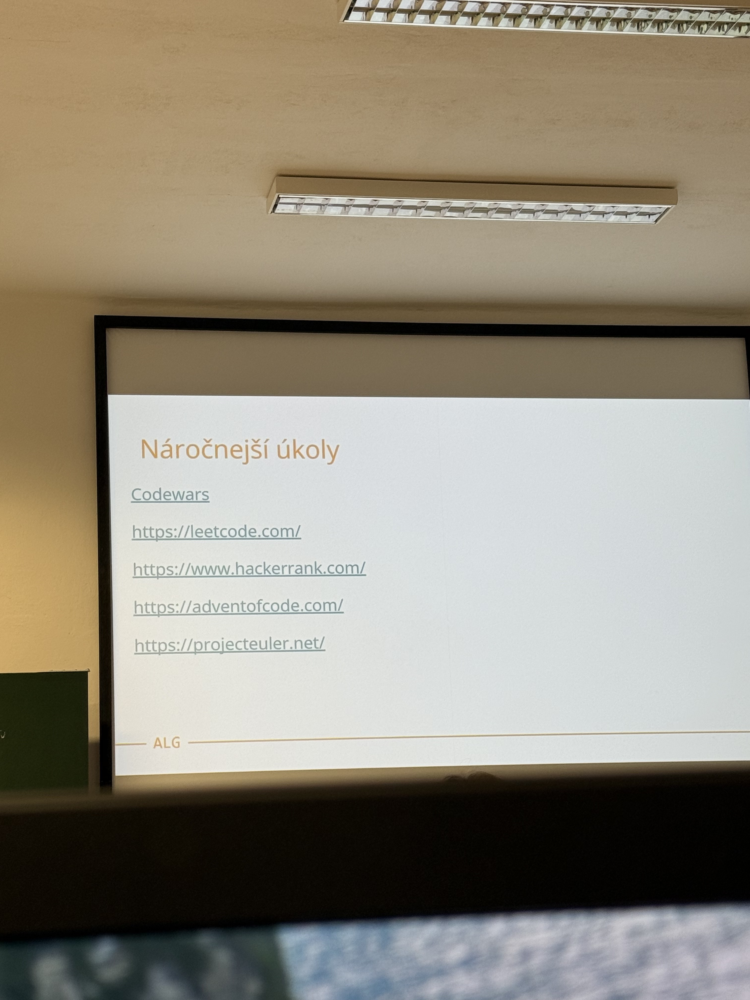
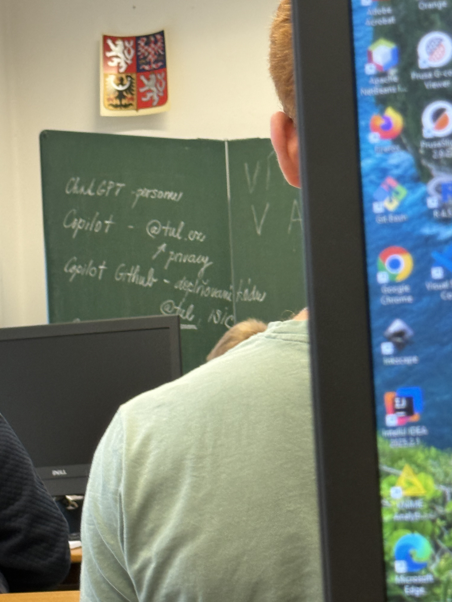
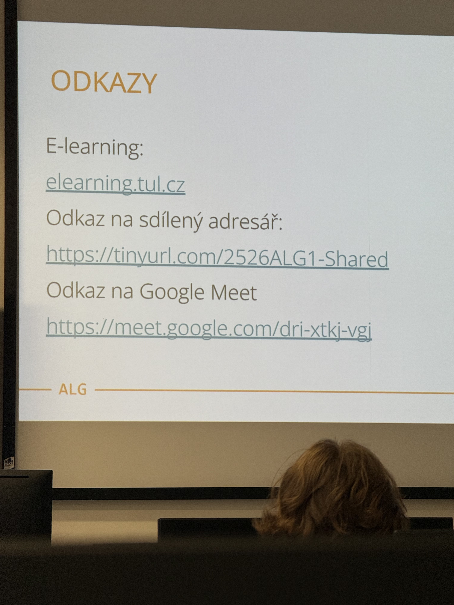
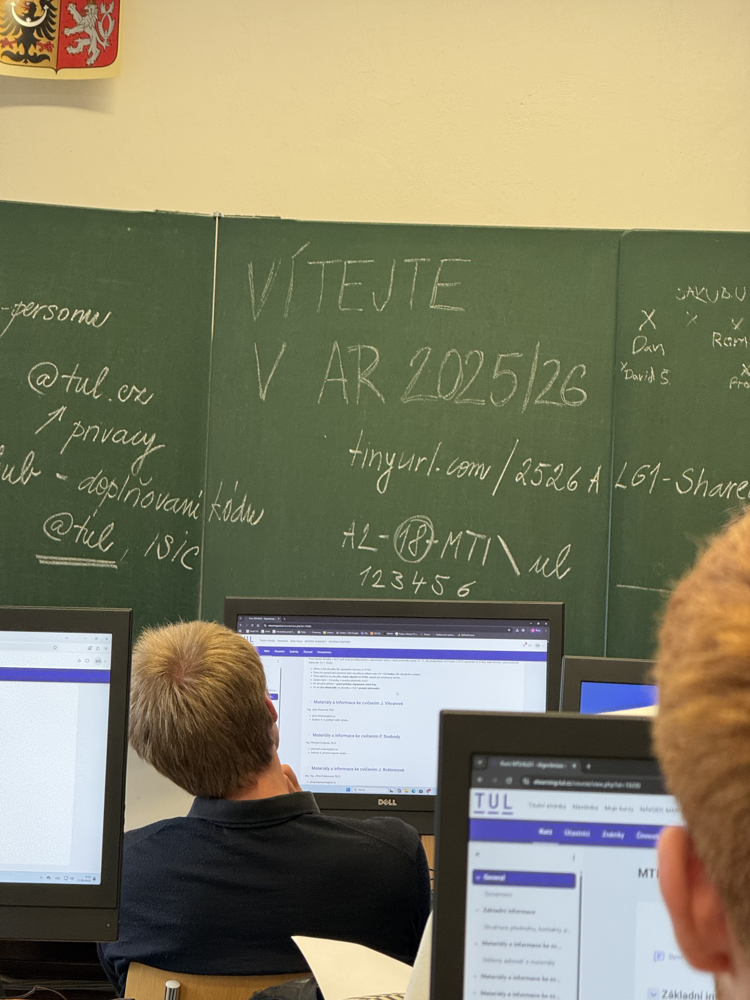

# Algoritmizace programovani - Java 1

## Co je algoritmizace?

- **Algoritmus** = přesný postup kroků, jak vyřešit daný problém.
- Algoritmizace = umění problém správně **rozložit** na kroky a převést ho do podoby, kterou zvládne počítač.
- Hlavní myšlenka: **od problému → k algoritmu → k programu**.

## Proč Java?

- Java je objektově orientovaný jazyk, jednoduchý na naučení, přenosný a univerzální.
- Program se píše do **tříd (`class`)** a spouští se přes **metodu `main`**.
- Syntaxe je podobná C/C++, ale je přívětivější pro začátečníky.

## Základní stavební kameny v Javě

1. **Datové typy** – `int`, `double`, `char`, `boolean`, `String`
2. **Vstup a výstup** – `System.out.println()`, `Scanner` pro čtení vstupu
3. **Podmínky** – `if`, `else if`, `else`, logické operátory (`==`, `!=`, `<`, `>`, `&&`, `||`)
4. **Cykly** – `for`, `while`, `do-while`
5. **Pole a řetězce** – ukládání více hodnot
6. **Metody (funkce)** – rozdělení programu na menší části
7. **Objekty a třídy** – základ objektového programování

## Jak probíhá výuka / cvičení

- Nejprve **základní příkazy a logika**.
- Od jednoduchých programů („Hello World“, kalkulačka) k algoritmům řešícím složitější úlohy.
- Hodně důraz na **samostatné úlohy** (počítání, podmínky, smyčky, práce s čísly a textem).

Typický postup:

1. Teorie → vysvětlení nových konstrukcí
2. Ukázka → malý příklad
3. Samostatné úlohy → od základních po složitější

## Užitečné tipy

- Piš hodně kódu a testuj → praxe je klíč.
- Čti chybové hlášky – Java je přísná, ale napoví.
- Začni jednoduše a postupně přidávej složitost.
- Komentuj kód (`// poznámka`) → usnadní ladění.

## Přehled výuky

<iframe src="https://elearning.tul.cz/course/view.php?id=19200" width="100%" height="800px"></iframe>

- [Přehled na Elearning](https://elearning.tul.cz/course/view.php?id=19200)

## Důležíté obrázky informační

## Úlohy v Javě

### alg1_ulohy01_zaciname.pdf

<iframe src="alg1_ulohy01_zaciname.pdf" width="100%" height="800px"></iframe>

[Otevřít / Stáhnout soubor.pdf](alg1_ulohy01_zaciname.pdf)

### alg1_ulohy02_pocitame.pdf

<iframe src="alg1_ulohy02_pocitame.pdf" width="100%" height="800px"></iframe>

[Otevřít / Stáhnout soubor.pdf](alg1_ulohy02_pocitame.pdf)

### alg1_ulohy03_nejen_pocitame.pdf

<iframe src="alg1_ulohy03_nejen_pocitame.pdf" width="100%" height="800px"></iframe>

[Otevřít / Stáhnout soubor.pdf](alg1_ulohy03_nejen_pocitame.pdf)

### alg1_ulohy04_primitiva_sekvence.pdf

<iframe src="alg1_ulohy04_primitiva_sekvence.pdf" width="100%" height="800px"></iframe>

[Otevřít / Stáhnout soubor.pdf](alg1_ulohy04_primitiva_sekvence.pdf)

### alg1_ulohy05_cleneni_kodu.pdf

<iframe src="alg1_ulohy05_cleneni_kodu.pdf" width="100%" height="800px"></iframe>

[Otevřít / Stáhnout soubor.pdf](alg1_ulohy05_cleneni_kodu.pdf)

### alg1_ulohy06_vse_si_pamatuji.pdf

<iframe src="alg1_ulohy06_vse_si_pamatuji.pdf" width="100%" height="800px"></iframe>

[Otevřít / Stáhnout soubor.pdf](alg1_ulohy06_vse_si_pamatuji.pdf)

### alg1_ulohy07_dalsi_dimenze.pdf

<iframe src="alg1_ulohy07_dalsi_dimenze.pdf" width="100%" height="800px"></iframe>

[Otevřít / Stáhnout soubor.pdf](alg1_ulohy07_dalsi_dimenze.pdf)

### alg1_ulohy08_data_pole_struktury.pdf

<iframe src="alg1_ulohy08_data_pole_struktury.pdf" width="100%" height="800px"></iframe>

[Otevřít / Stáhnout soubor.pdf](alg1_ulohy08_data_pole_struktury.pdf)
