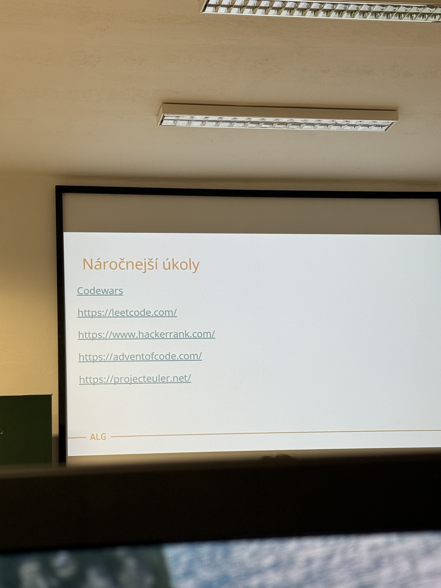
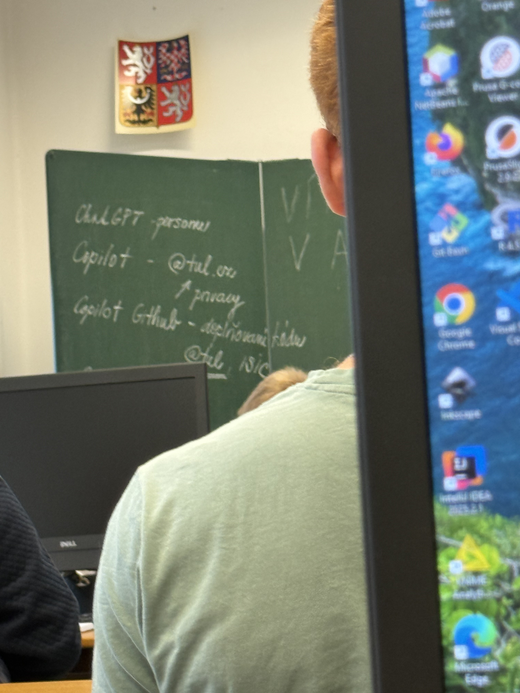
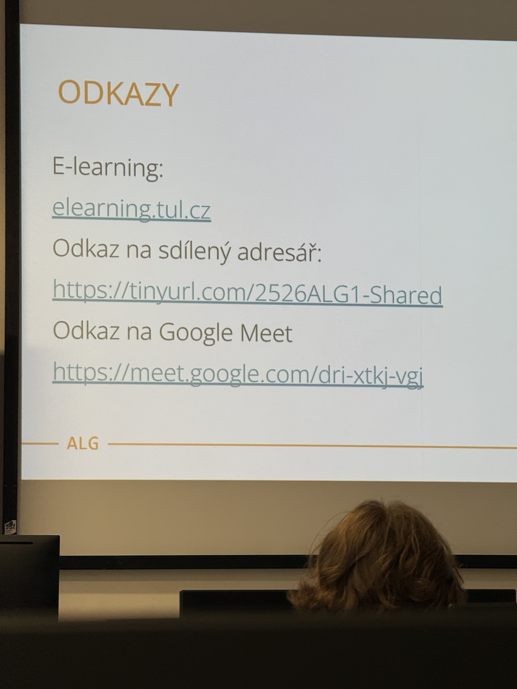
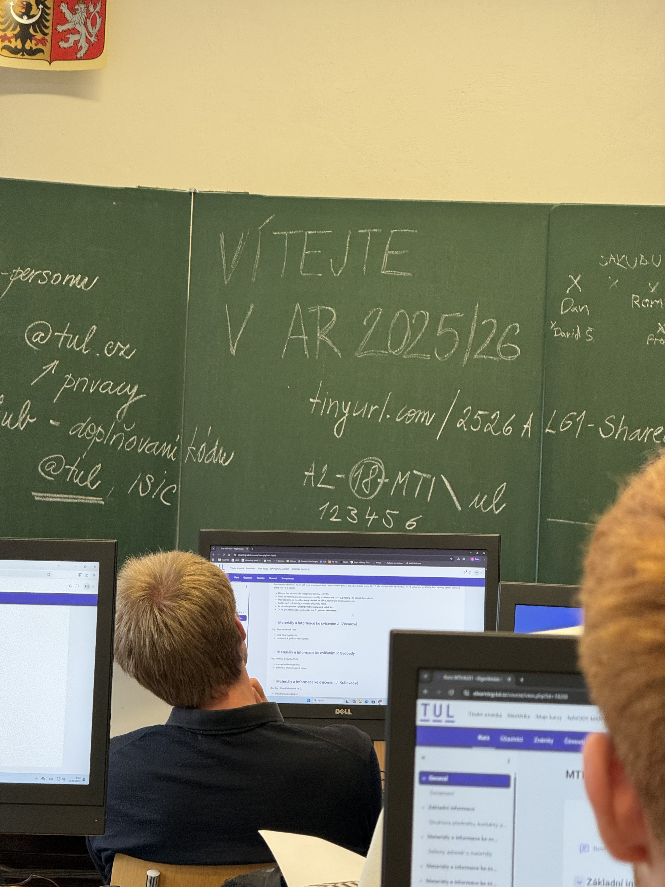

# Algoritmizace programovani - Java 1

Obsah složky `algoritmizace_programovani_java_1`:

- `KMA-PULA.pdf`
- `IMG_2239.jpg`, `IMG_2240.jpg`, `IMG_2241.jpg`, `IMG_2242.jpg`
- `alg1_ulohy01_zaciname.pdf`, `alg1_ulohy02_pocitame.pdf`, `alg1_ulohy03_nejen_pocitame.pdf`

Tady jsou soubory a složky z `algoritmizace_programovani_java_1`.

### Důležíté obrázky

### Úlohy v Javě

### alg1_ulohy01_zaciname.pdf

<iframe src="alg1_ulohy01_zaciname.pdf" width="100%" height="800px"></iframe>

[Stáhnout soubor.pdf](alg1_ulohy01_zaciname.pdf)

### alg1_ulohy02_pocitame.pdf

<iframe src="alg1_ulohy02_pocitame.pdf" width="100%" height="800px"></iframe>

[Stáhnout soubor.pdf](alg1_ulohy02_pocitame.pdf)

### alg1_ulohy03_nejen_pocitame.pdf

<iframe src="alg1_ulohy03_nejen_pocitame.pdf" width="100%" height="800px"></iframe>

[Stáhnout soubor.pdf](alg1_ulohy03_nejen_pocitame.pdf)
