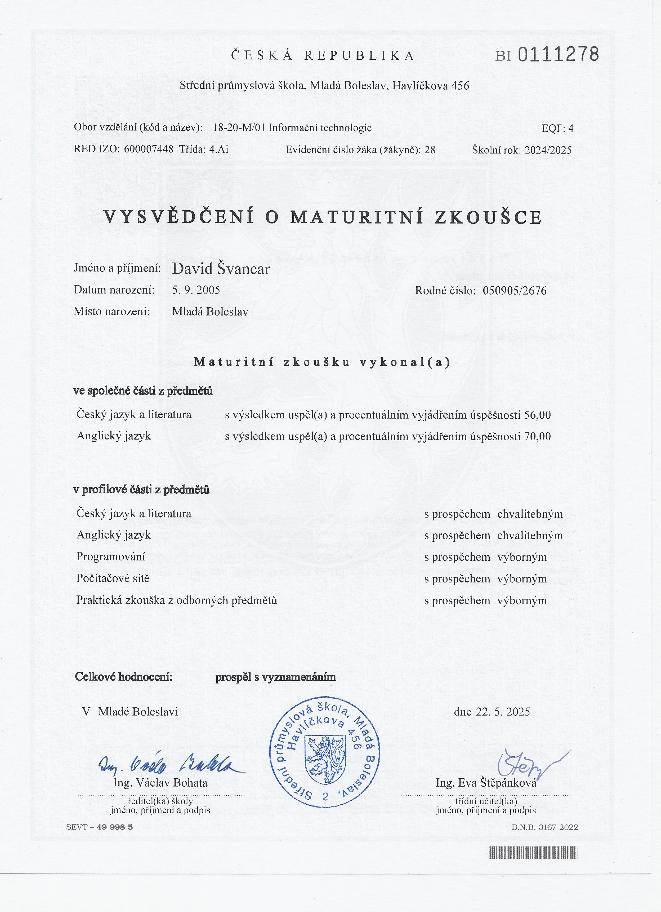
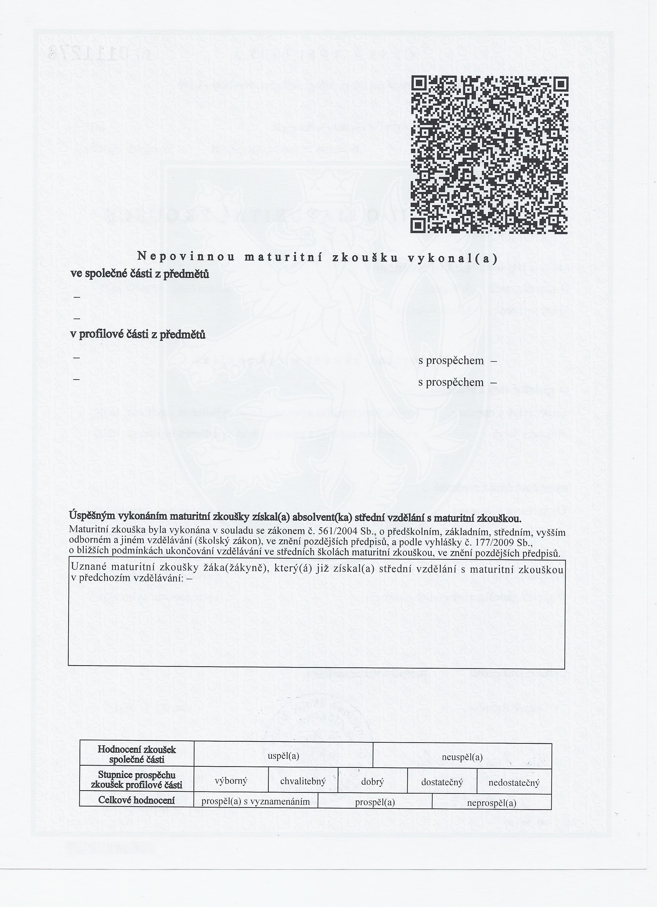
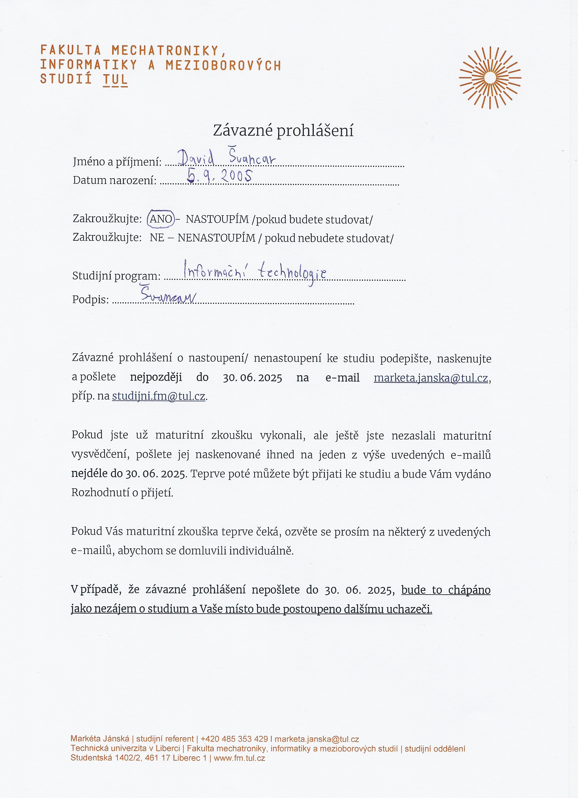

# Dokumenty

Obsah složky `dokumenty`:

- `soubor.pdf`, `Zapis-prezentace.pdf` ,`Zavazne-prohlaseni.pdf`
- `kod tul.txt`
- `heslo do liane.txt`

### soubor.pdf

<iframe src="soubor.pdf" width="100%" height="800px"></iframe>

[Stáhnout soubor.pdf](soubor.pdf)

### Zapis-prezentace.pdf

<iframe src="Zapis-prezentace.pdf" width="100%" height="800px"></iframe>

[Stáhnout Zapis-prezentace.pdf](Zapis-prezentace.pdf)

### Zavazne-prohlaseni.pdf

<iframe src="Zavazne-prohlaseni.pdf" width="100%" height="800px"></iframe>

[Stáhnout Zavazne-prohlaseni.pdf](Zavazne-prohlaseni.pdf)

### Dulžité udaje 

### Důležité dokumenty

