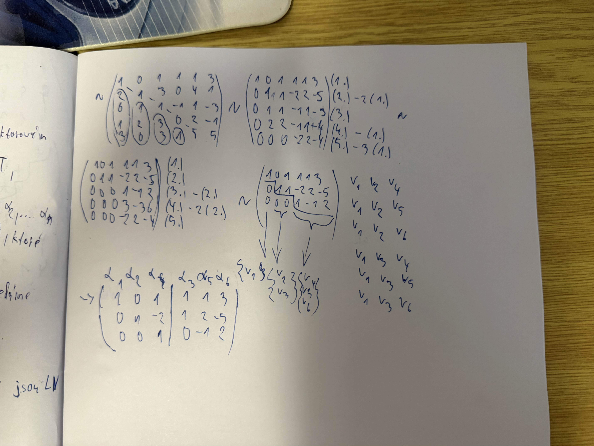
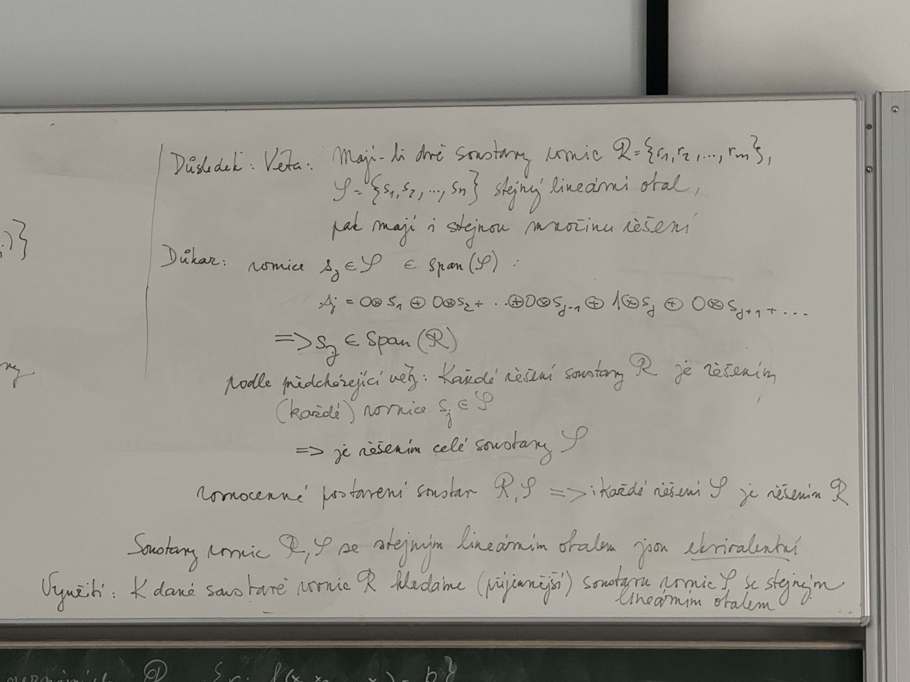
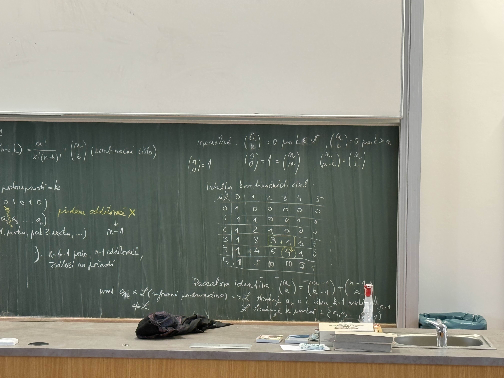
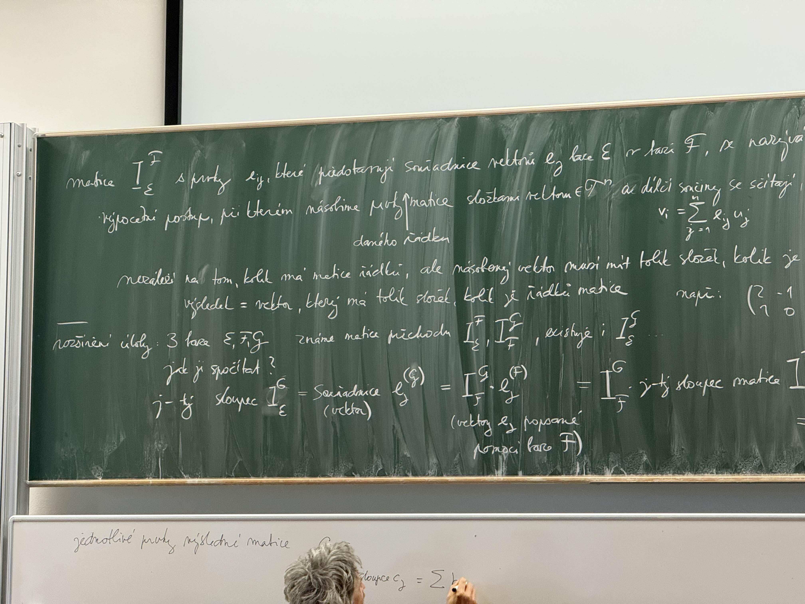
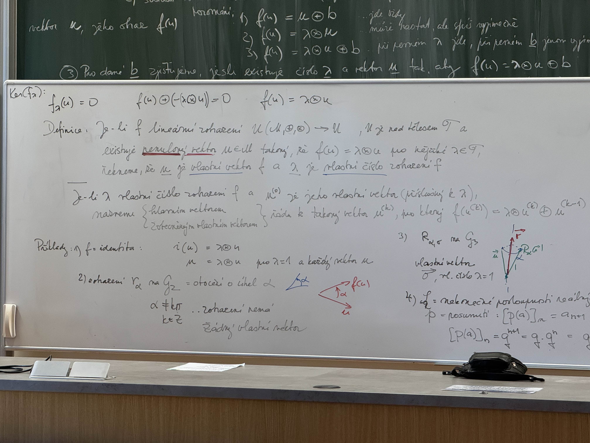
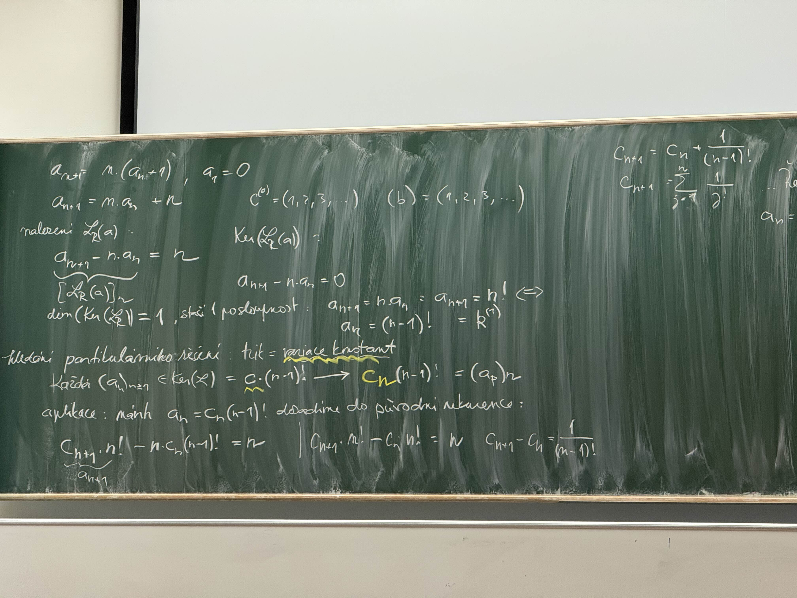
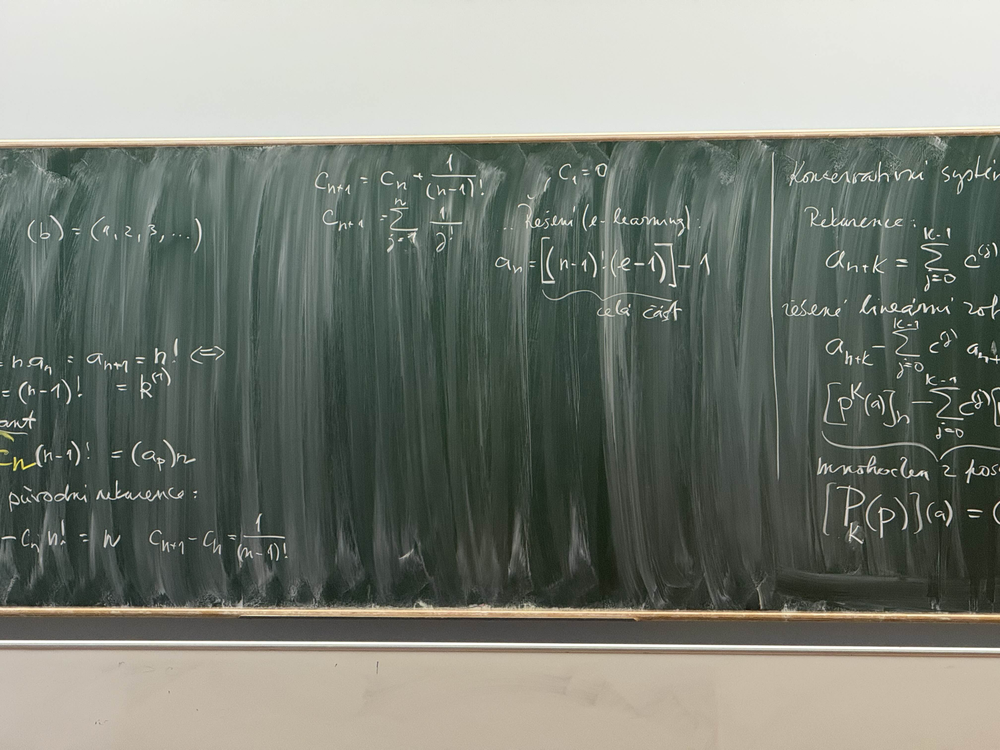
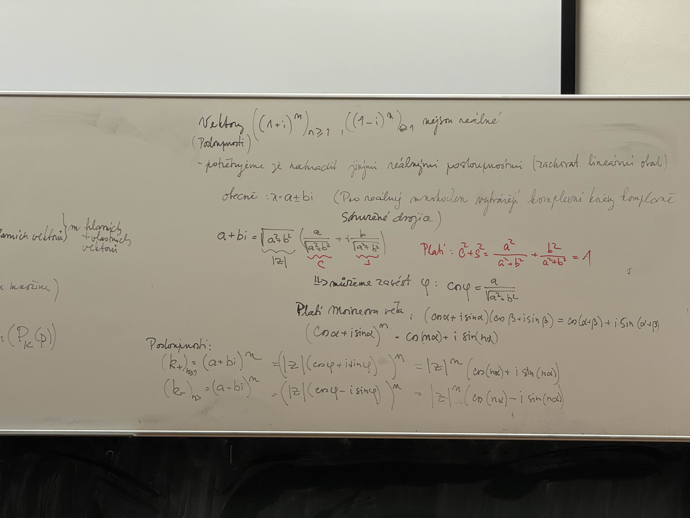

# Lineární algebra / Diskrétní mat

## Lineární algebra

Zabývá se **vektory, maticemi, determinanty, soustavami lineárních rovnic** a dalšími lineárními strukturami.

**Základní nástroje:**

- Matice a vektory
- Determinanty
- Soustavy lineárních rovnic
- Vlastní čísla a vlastní vektory

**Proč je důležitá:**

- Základ pro **grafiku, strojové učení, fyzikální modelování**
- Prakticky všude, kde se pracuje s daty v prostoru

## Diskrétní matematika

Zkoumá objekty, které jsou **oddělené a nespojité**.

**Patří sem:**

- Logika a predikáty
- Množiny a relace
- Kombinatorika (počítání, permutace, kombinace)
- Grafy a stromy
- Číselné struktury (modulární aritmetika, kongruence)

**Proč je důležitá:**

- Dává teoretický základ informatiky, algoritmů, sítí, kryptografie a databází

## Přehled výuky

<iframe src="https://elearning.tul.cz/course/view.php?id=20460" width="100%" height="800px"></iframe>

- [Přehled na Elearning](https://elearning.tul.cz/course/view.php?id=20460)

## Příprava ke zkoušce

<iframe src="priprava_ke_zkousce.pdf" width="100%" height="800px"></iframe>

[Otevřít / Stáhnout priprava_ke_zkousce.pdf](priprava_ke_zkousce.pdf)

## Cvičení

### Páté cvičení

### Přílady na inverzní matice

#### Um3-1-1.ps.pdf

<iframe src="cviceni/inverzni_matice/Um3-1-1.ps.pdf" width="100%" height="800px"></iframe>

[Otevřít / Stáhnout Um3-1-1.ps.pdf](cviceni/inverzni_matice/Um3-1-1.ps.pdf)

#### Um4-1-1.ps.pdf

<iframe src="cviceni/inverzni_matice/Um4-1-1.ps.pdf" width="100%" height="800px"></iframe>

[Otevřít / Stáhnout Um4-1-1.ps.pdf](cviceni/inverzni_matice/Um4-1-1.ps.pdf)

### Všechny symetrické celočíselné matice s celočíselnými vlastními čísly

<iframe src="cviceni/vsechny_symetricke_celociselne_matice_s_celociselnymi_vlastnimi_cisly/eigpbs_symmetric_9" width="100%" height="800px"></iframe>

[Otevřít / Stáhnout eigpbs_symmetric_9.pdf](cviceni/vsechny_symetricke_celociselne_matice_s_celociselnymi_vlastnimi_cisly/eigpbs_symmetric_9.pdf)

## Přednášky

### První a druhá přednáška

### Zobrazení, Matemtická indukce a Kombinatorika

<iframe src="KMA-PULA.pdf" width="100%" height="800px"></iframe>

[Otevřít / Stáhnout KMA-PULA.pdf](KMA-PULA.pdf)

### Třetí přednáška

#### Vektory a vektorové prostory

### Čtvrtá přednáška

#### Lineářní kombinace vektorů

### Pátá přednáška

#### Kombinace a Kombinační čísla

#### Binomická Věta

#### Multinomická Věta

### Šestá přednáška

#### Lineární závislost vektorů a související pojmy

### Sedmá přednáška

#### Báze vektorového prostoru

### Osmá přednáška

#### Úvod do teorie grafů

#### Vztahy mezi grafy a základní operace

### Devátá přednáška

#### Lineární zobrazení na vektrových prostorech

#### Test linearity zobrazení

#### Test aditivity a homogenity

#### Základní vlastnosti lineárních zobrazení

### Desátá přednáška

### Jedenáctá přednáška

#### Souvislé grafy

#### Úlohy pro souvislé grafy a jejich řešení

#### Nalezení nejkratší cesty mezi dvěma vrcholy

### Dvanáctá přednáška

#### Lineární zobrazení vektorového prostoru do sebe

#### Vlastnosti vlastních vektorů

#### Technika hledání vlastních vektorů a čísel

### Třináctá přednáška

#### Mocniny a mnohočleny z lineárního zobrazení vektorového prostoru do sebe

#### Vlastní vektory a vlastní čísla mnohočlenu z lineárního endomorfismu

#### Určení charakteristického mnohočlenu

### Čtrnáctá přednáška

#### Kostra grafu

#### Posloupnosti

#### Absolutně definovaná posloupnost

### Patnáctá přednáška

#### Linearni kombinace vektrorů

