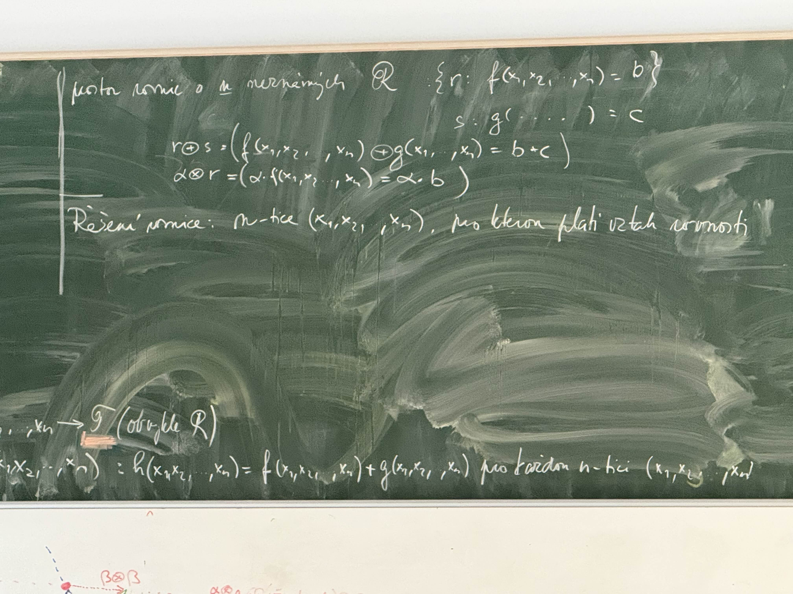
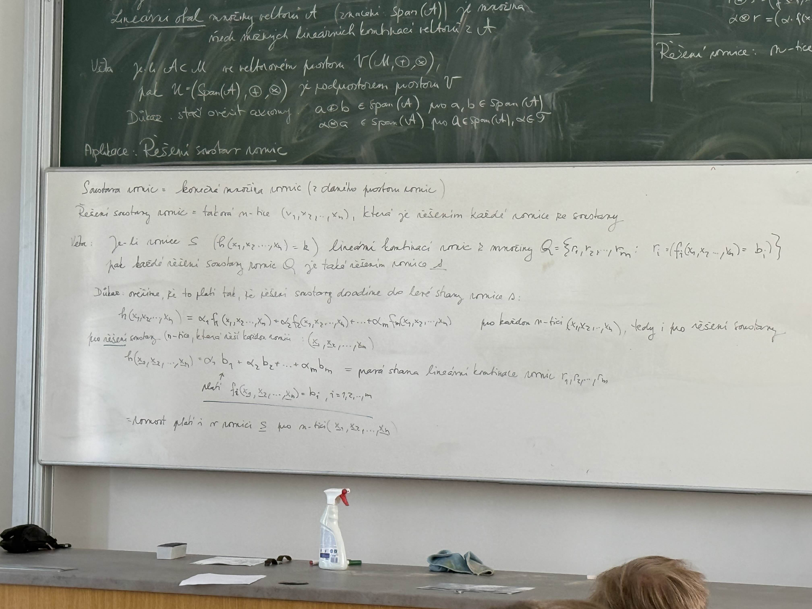
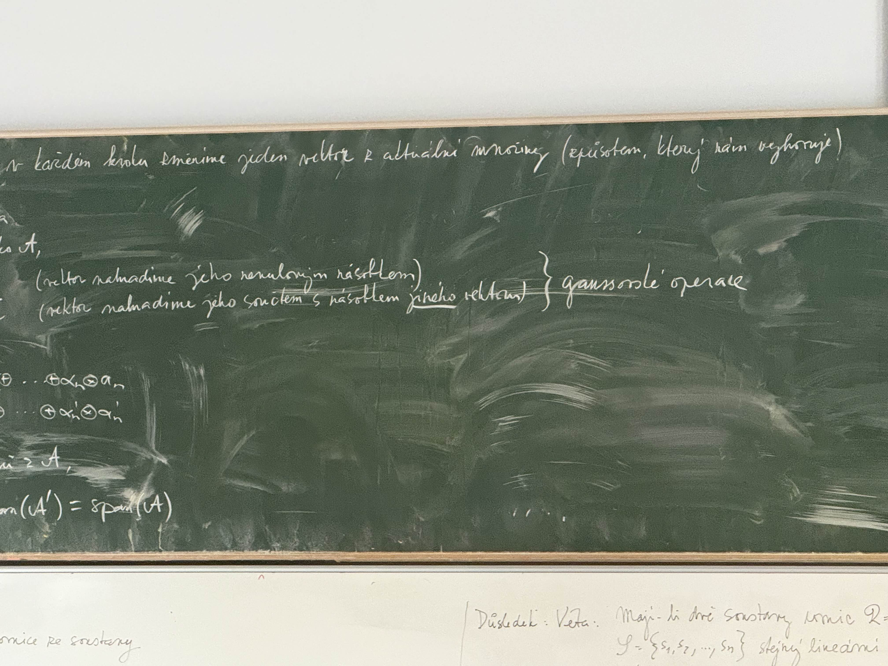

# Lineární algebra / Diskrétní mat

## Lineární algebra

Zabývá se **vektory, maticemi, determinanty, soustavami lineárních rovnic** a dalšími lineárními strukturami.

**Základní nástroje:**

- Matice a vektory
- Determinanty
- Soustavy lineárních rovnic
- Vlastní čísla a vlastní vektory

**Proč je důležitá:**

- Základ pro **grafiku, strojové učení, fyzikální modelování**
- Prakticky všude, kde se pracuje s daty v prostoru

## Diskrétní matematika

Zkoumá objekty, které jsou **oddělené a nespojité**.

**Patří sem:**

- Logika a predikáty
- Množiny a relace
- Kombinatorika (počítání, permutace, kombinace)
- Grafy a stromy
- Číselné struktury (modulární aritmetika, kongruence)

**Proč je důležitá:**

- Dává teoretický základ informatiky, algoritmů, sítí, kryptografie a databází

## Přehled výuky

<iframe src="https://elearning.tul.cz/course/view.php?id=20460" width="100%" height="800px"></iframe>

- [Přehled na Elearning](https://elearning.tul.cz/course/view.php?id=20460)

## Přednášky – rychlý přehled

### První a druhá přednáška

<iframe src="KMA-PULA.pdf" width="100%" height="800px"></iframe>

[Stáhnout pdf](KMA-PULA.pdf)

### Třetí přednáška

