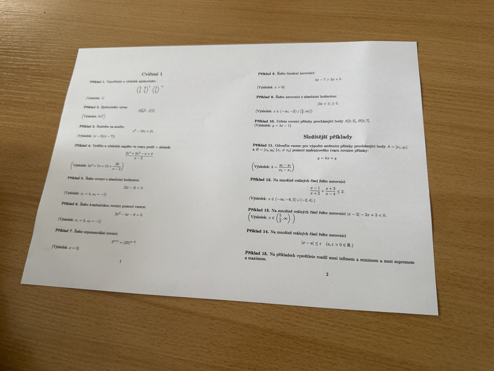
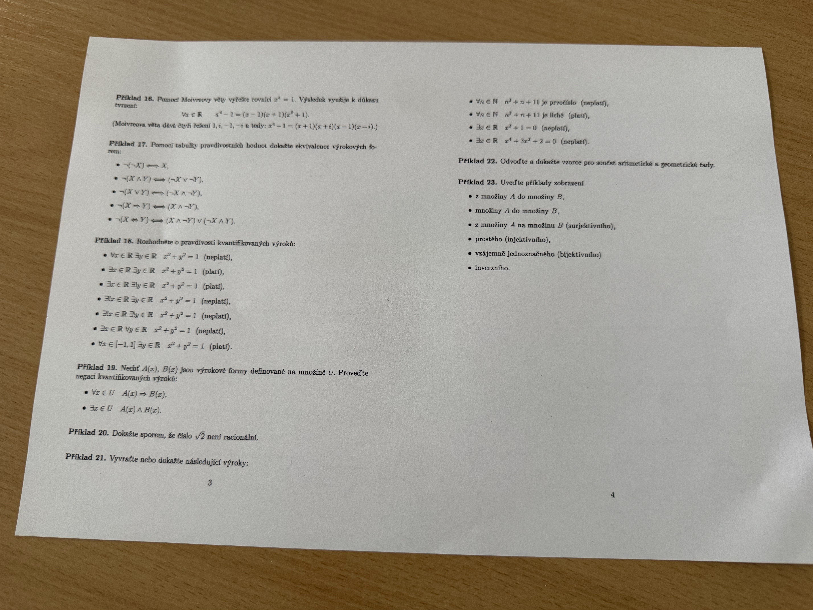
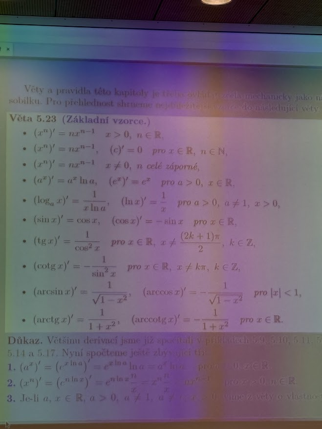

# Matematika 1

## Základní info:

Předmět **Matematika 1** na TUL (Technická univerzita v Liberci) je úvodní kurz vysokoškolské matematiky. Navazuje na znalosti ze střední školy a rozšiřuje je o důležité kapitoly pro technické a přírodovědné obory.  
Typicky se probírá:

- **Základy diferenciálního a integrálního počtu** (funkce, limity, derivace, integrály)
- **Lineární algebra** (matice, vektory, soustavy lineárních rovnic)
- **Kombinatorika, pravděpodobnost a statistika** (základy, často jen úvod)
- **Řešení příkladů a aplikace v praxi** (inženýrské i přírodovědné problémy)

Cílem předmětu je:

- naučit studenty **pracovat s funkcemi** a chápat jejich vlastnosti,
- **počítat limity, derivace a integrály**,
- používat matematiku jako nástroj pro technické aplikace,
- procvičit logické a abstraktní myšlení.

## Přehled výuky

<iframe src="https://elearning.tul.cz/course/view.php?id=20189" width="100%" height="800px"></iframe>

- [Přehled na Elearning](https://elearning.tul.cz/course/view.php?id=20189)

Odkazy a vložené PDF:

### PrehledSS.pdf

<iframe src="PrehledSS.pdf" width="100%" height="800px"></iframe>

[Stáhnout PrehledSS.pdf](PrehledSS.pdf)

### Prvni_prednaska.pdf

<iframe src="Prvni_prednaska.pdf" width="100%" height="800px"></iframe>

[Stáhnout Prvni_prednaska.pdf](Prvni_prednaska.pdf)

### Druha_prednaska.pdf

<iframe src="Druha_prednaska.pdf" width="100%" height="800px"></iframe>

[Stáhnout Druha_prednaska.pdf](Druha_prednaska.pdf)

### Treti_prednaska.pdf

<iframe src="Treti_prednaska.pdf" width="100%" height="800px"></iframe>

[Stáhnout Treti_prednaska.pdf](Treti_prednaska.pdf)

### Příklady_MA1.pdf

<iframe src="Příklady_MA1.pdf" width="100%" height="800px"></iframe>

[Stáhnout Příklady_MA1.pdf](Příklady_MA1.pdf)

### První cvičení

### Cviceni3N.pdf

<iframe src="Cviceni3N.pdf" width="100%" height="800px"></iframe>

[Stáhnout Příklady_MA1.pdf](Cviceni3N.pdf)

### Důležité fotky z přednašky

