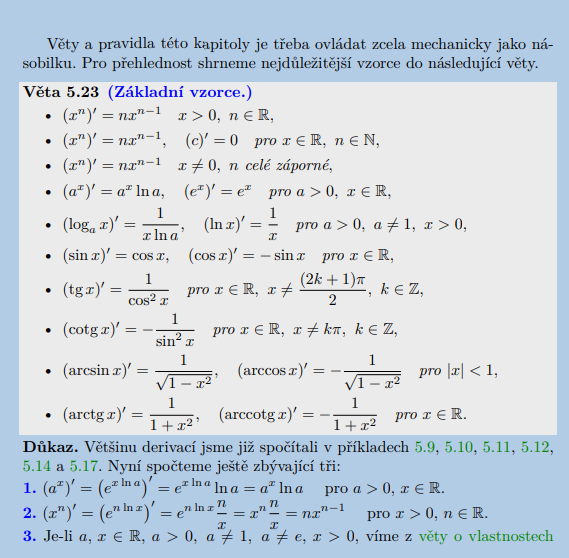

# Matematika 1

## Základní info:

Předmět **Matematika 1** na TUL (Technická univerzita v Liberci) je úvodní kurz vysokoškolské matematiky. Navazuje na znalosti ze střední školy a rozšiřuje je o důležité kapitoly pro technické a přírodovědné obory.  
Typicky se probírá:

- **Základy diferenciálního a integrálního počtu** (funkce, limity, derivace, integrály)
- **Lineární algebra** (matice, vektory, soustavy lineárních rovnic)
- **Kombinatorika, pravděpodobnost a statistika** (základy, často jen úvod)
- **Řešení příkladů a aplikace v praxi** (inženýrské i přírodovědné problémy)

Cílem předmětu je:

- naučit studenty **pracovat s funkcemi** a chápat jejich vlastnosti,
- **počítat limity, derivace a integrály**,
- používat matematiku jako nástroj pro technické aplikace,
- procvičit logické a abstraktní myšlení.

## Přehled výuky

<iframe src="https://elearning.tul.cz/course/view.php?id=20189" width="100%" height="800px"></iframe>

- [Přehled na Elearning](https://elearning.tul.cz/course/view.php?id=20189)

## Sředoškolský přehled

<iframe src="./prednasky/PrehledSS.pdf" width="100%" height="800px"></iframe>

[Otevřít / Stáhnout PrehledSS.pdf](./prednasky/PrehledSS.pdf)

## Přednášky

### Prvni_prednaska.pdf

<iframe src="./prednasky/Prvni_prednaska.pdf" width="100%" height="800px"></iframe>

[Otevřít / Stáhnout Prvni_prednaska.pdf](./prednasky/Prvni_prednaska.pdf)

### Druha_prednaska.pdf

<iframe src="./prednasky/Druha_prednaska.pdf" width="100%" height="800px"></iframe>

[Otevřít / Stáhnout Druha_prednaska.pdf](./prednasky/Druha_prednaska.pdf)

### Treti_prednaska.pdf

<iframe src="./prednasky/Treti_prednaska.pdf" width="100%" height="800px"></iframe>

[Otevřít / Stáhnout Treti_prednaska.pdf](./prednasky/Treti_prednaska.pdf)

### Ctvrta_prednaska.pdf

<iframe src="./prednasky/Ctvrta_prednaska.pdf" width="100%" height="800px"></iframe>

[Otevřít / Stáhnout Ctvrta_prednaska.pdf](./prednasky/Ctvrta_prednaska.pdf)

### Pata_prednaska.pdf

<iframe src="./prednasky/Pata_prednaska.pdf" width="100%" height="800px"></iframe>

[Otevřít / Stáhnout Pata_prednaska.pdf](./prednasky/Pata_prednaska.pdf)

### SestaSedma_prednaska.pdf

<iframe src="./prednasky/SestaSedma_prednaska.pdf" width="100%" height="800px"></iframe>

[Otevřít / Stáhnout SestaSedma_prednaska.pdf](./prednasky/SestaSedma_prednaska.pdf)

### OsmaDevata_prednaska.pdf

<iframe src="./prednasky/OsmaDevata_prednaska.pdf" width="100%" height="800px"></iframe>

[Otevřít / Stáhnout OsmaDevata_prednaska.pdf](./prednasky/OsmaDevata_prednaska.pdf)

### Důležité fotky z přednašky

## Příklady_MA1.pdf z [KM.tul](https://kma.fp.tul.cz/)

<iframe src="Příklady_MA1.pdf" width="100%" height="800px"></iframe>

[Otevřít / Stáhnout Příklady_MA1.pdf](Příklady_MA1.pdf)

## Cvičení

### První cvičení

### Cviceni3N.pdf

<iframe src="./cviceni/Cviceni3N.pdf" width="100%" height="800px"></iframe>

[Otevřít / Stáhnout Cviceni3N.pdf](./cviceni/Cviceni3N.pdf)

### Cviceni4N.pdf

<iframe src="./cviceni/Cviceni4N.pdf" width="100%" height="800px"></iframe>

[Otevřít / Stáhnout Cviceni4N.pdf](./cviceni/Cviceni4N.pdf)

### Cviceni5N.pdf

<iframe src="./cviceni/Cviceni5N.pdf" width="100%" height="800px"></iframe>

[Otevřít / Stáhnout Cviceni5N.pdf](./cviceni/Cviceni5N.pdf)

### Cviceni6N.pdf

<iframe src="./cviceni/Cviceni6N.pdf" width="100%" height="800px"></iframe>

[Otevřít / Stáhnout Cviceni6N.pdf](./cviceni/Cviceni6N.pdf)

### Cviceni7N.pdf

<iframe src="./cviceni/Cviceni7N.pdf" width="100%" height="800px"></iframe>

[Otevřít / Stáhnout Cviceni7N.pdf](./cviceni/Cviceni7N.pdf)
