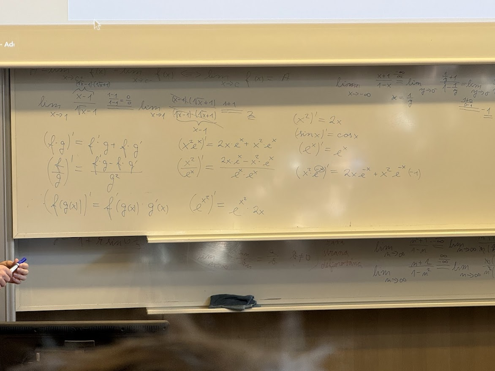

# Matematika 1

## Základní info:

Předmět **Matematika 1** na TUL (Technická univerzita v Liberci) je úvodní kurz vysokoškolské matematiky. Navazuje na znalosti ze střední školy a rozšiřuje je o důležité kapitoly pro technické a přírodovědné obory.  
Typicky se probírá:

- **Základy diferenciálního a integrálního počtu** (funkce, limity, derivace, integrály)
- **Lineární algebra** (matice, vektory, soustavy lineárních rovnic)
- **Kombinatorika, pravděpodobnost a statistika** (základy, často jen úvod)
- **Řešení příkladů a aplikace v praxi** (inženýrské i přírodovědné problémy)

Cílem předmětu je:

- naučit studenty **pracovat s funkcemi** a chápat jejich vlastnosti,
- **počítat limity, derivace a integrály**,
- používat matematiku jako nástroj pro technické aplikace,
- procvičit logické a abstraktní myšlení.

## Přehled výuky

<iframe src="https://elearning.tul.cz/course/view.php?id=20189" width="100%" height="800px"></iframe>

- [Přehled na Elearning](https://elearning.tul.cz/course/view.php?id=20189)

## Sředoškolský přehled

<iframe src="./prednasky/Přehled_SŠ.pdf" width="100%" height="800px"></iframe>

[Otevřít / Stáhnout Přehled_SŠ.pdf](./prednasky/Přehled_SŠ.pdf)

## Přednášky

### Nekonečno_intervaly_a_komplexni_cisla.pdf

<iframe src="./prednasky/Nekonečno_intervaly_a_komplexni_cisla.pdf" width="100%" height="800px"></iframe>

[Otevřít / Stáhnout Nekonečno_intervaly_a_komplexni_cisla.pdf](./prednasky/Nekonečno_intervaly_a_komplexni_cisla.pdf)

### Funkce.pdf

<iframe src="./prednasky/Funkce.pdf" width="100%" height="800px"></iframe>

[Otevřít / Stáhnout Funkce.pdf](./prednasky/Funkce.pdf)

### Posloupnosti.pdf

<iframe src="./prednasky/Posloupnosti.pdf" width="100%" height="800px"></iframe>

[Otevřít / Stáhnout Posloupnosti.pdf](./prednasky/Posloupnosti.pdf)

### Spojitost_a_limita_funkce.pdf

<iframe src="./prednasky/Spojitost_a_limita_funkce.pdf" width="100%" height="800px"></iframe>

[Otevřít / Stáhnout Spojitost_a_limita_funkce.pdf](./prednasky/Spojitost_a_limita_funkce.pdf)

### Derivace.pdf

<iframe src="./prednasky/Derivace.pdf" width="100%" height="800px"></iframe>

[Otevřít / Stáhnout Derivace.pdf](./prednasky/Derivace.pdf)

### Průběh_funkce.pdf

<iframe src="./prednasky/Průběh_funkce.pdf" width="100%" height="800px"></iframe>

[Otevřít / Stáhnout Průběh_funkce.pdf](./prednasky/Průběh_funkce.pdf)

### Primitivní_funkce.pdf

<iframe src="./prednasky/Primitivní_funkce.pdf" width="100%" height="800px"></iframe>

[Otevřít / Stáhnout Primitivní_funkce.pdf](./prednasky/Primitivní_funkce.pdf)

### Rozklad_na_parciální_zlomky.pdf

<iframe src="./prednasky/Rozklad_na_parciální_zlomky.pdf" width="100%" height="800px"></iframe>

[Otevřít / Stáhnout Rozklad_na_parciální_zlomky.pdf](./prednasky/Rozklad_na_parciální_zlomky.pdf)

### Obsah_a_zobecněný_integrál.pdf

<iframe src="./prednasky/Obsah_a_zobecněný_integrál.pdf" width="100%" height="800px"></iframe>

[Otevřít / Stáhnout Obsah_a_zobecněný_integrál.pdf](./prednasky/Obsah_a_zobecněný_integrál.pdf)

### Důležité fotky z přednašky

## Příklady_MA1.pdf z [KM.tul](https://kma.fp.tul.cz/)

<iframe src="Příklady_MA1.pdf" width="100%" height="800px"></iframe>

[Otevřít / Stáhnout Příklady_MA1.pdf](Příklady_MA1.pdf)

## Cvičení

### První cvičení

### Cviceni3N.pdf

<iframe src="./cviceni/Cviceni3N.pdf" width="100%" height="800px"></iframe>

[Otevřít / Stáhnout Cviceni3N.pdf](./cviceni/Cviceni3N.pdf)

### Cviceni4N.pdf

<iframe src="./cviceni/Cviceni4N.pdf" width="100%" height="800px"></iframe>

[Otevřít / Stáhnout Cviceni4N.pdf](./cviceni/Cviceni4N.pdf)

### Cviceni5N.pdf

<iframe src="./cviceni/Cviceni5N.pdf" width="100%" height="800px"></iframe>

[Otevřít / Stáhnout Cviceni5N.pdf](./cviceni/Cviceni5N.pdf)

### Cviceni6N.pdf

<iframe src="./cviceni/Cviceni6N.pdf" width="100%" height="800px"></iframe>

[Otevřít / Stáhnout Cviceni6N.pdf](./cviceni/Cviceni6N.pdf)

### Cviceni7N.pdf

<iframe src="./cviceni/Cviceni7N.pdf" width="100%" height="800px"></iframe>

[Otevřít / Stáhnout Cviceni7N.pdf](./cviceni/Cviceni7N.pdf)

### Cviceni8a9N.pdf

<iframe src="./cviceni/Cviceni8a9N.pdf" width="100%" height="800px"></iframe>

[Otevřít / Stáhnout Cviceni8a9N.pdf](./cviceni/Cviceni8a9N.pdf)

### Cviceni10N.pdf

<iframe src="./cviceni/Cviceni10N.pdf" width="100%" height="800px"></iframe>

[Otevřít / Stáhnout Cviceni10N.pdf](./cviceni/Cviceni10N.pdf)

### Cviceni11N.pdf

<iframe src="./cviceni/Cviceni11N.pdf" width="100%" height="800px"></iframe>

[Otevřít / Stáhnout Cviceni11N.pdf](./cviceni/Cviceni11N.pdf)

### Cviceni12N.pdf

<iframe src="./cviceni/Cviceni12N.pdf" width="100%" height="800px"></iframe>

[Otevřít / Stáhnout Cviceni12N.pdf](./cviceni/Cviceni12N.pdf)
