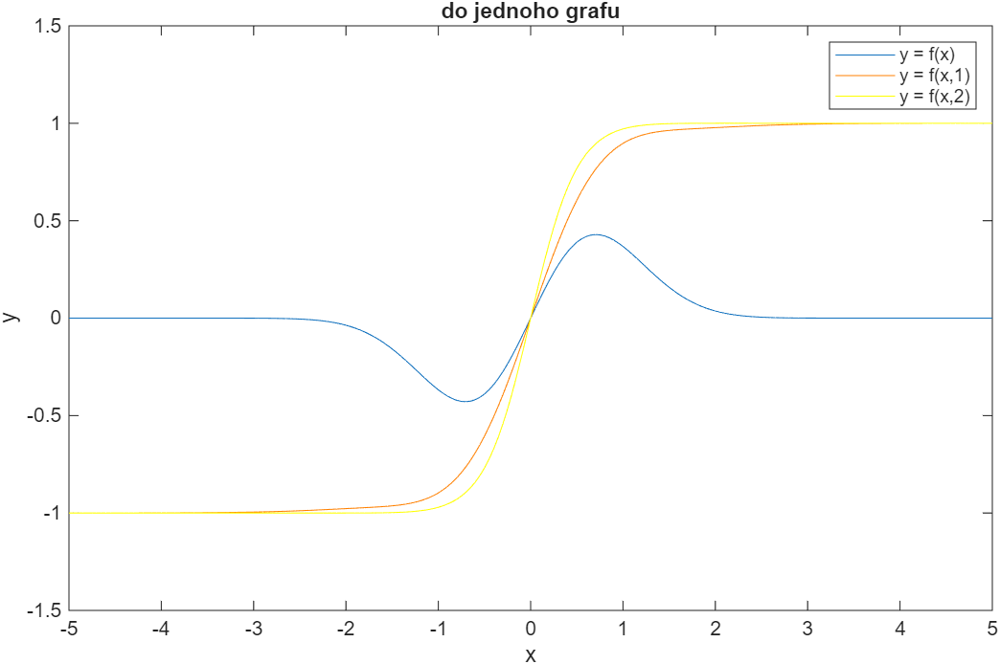
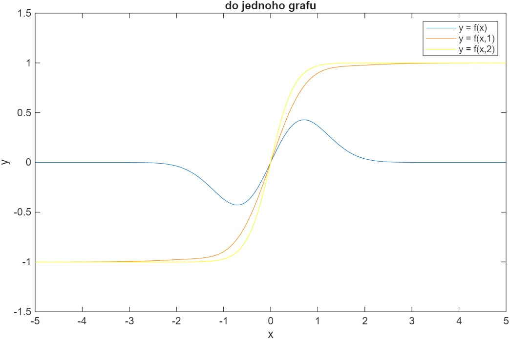

# Výpočty, simulace a vizualizace v Matlabu

Cvičení jsou zaměřená na **práci se skripty v Matlabu**, procvičení základních funkcí, tvorbu matic, práci s náhodnými čísly, cykly, funkcemi a jednoduchými algoritmy.

## Základy Matlabu

- Prostředí Matlabu, skripty a funkce
- Práce s okny, příkazy `clc`, `clear`, `close all`

  ## Vektory a matice

- Tvorba vektorů a matic
- Indexování, řádky vs. sloupce
- Operace: sčítání, násobení, transpozice, inverze

  ## Náhodná čísla a statistika

- Funkce `rand`, `randi`, `randn`
- Výpočty součtu, průměru, středních hodnot
- Manipulace s 3D maticemi

## Cyklus a podmínky

- `for`, `while`
- `if`, `else`, `elseif`
- Vnořené cykly a operace po prvcích

  ## Funkce a vlastní algoritmy

- Definice funkcí: `function`
- Implementace jednoduchých algoritmů (např. bubble sort)
- Vektorové vs. skalární operace

  ## Vizualizace

  - Grafy 2D a 3D (`plot`, `mesh`, `surf`)
  - Přehledné zobrazení dat a výsledků

## Základy a příkazy

- % - komentář
- ; na konci zamezí vypsání do konzole

### Zkratky

- ctrl R - koment
- ctrl T - zrusit koment
- F9 - spusti označenou cast kodu

### Udělat vždy

- clc; - vymaže konzoli
- clear;
- close all; - zavře soubory
- disp(x) - vypíše do konzole x (disp = display)
- 1:1:8 - generuje čísla od 1 do 8 po jednom

### Matice

- ones(3) - 3x3 matice s jedničkama
- zeros(3,4) - 3x4 matice s nulama
- eye(3) - jedničky na diagonale
- inv(Matice) - inverce matice
- A\*B - násobení matice
- A.\*B - násobení po prvcích

- squeeze(C(1,:,:)); - z 3D na 2D

### Random

- rand - nenáhodně
- randn - náhodně
- round zaokrouhlení
- mean - průměr
- numel - celkem prvku
- sum - součet

### Funkce

```matlab
function result = goniometricka_funkce(x)
    result = (sin(x)).^2 .* cos(x);
end
```

### Porovnání

- lexikograficky - porovná první řádek dvou sloupcu, pokud jsou stejné porovná druhý řádek

## Přehled výuky

<iframe src="https://elearning.tul.cz/course/view.php?id=20012" width="100%" height="800px"></iframe>

- [Přehled na Elearning](https://elearning.tul.cz/course/view.php?id=20012)

## Přednášky

### První přednáška

<iframe src="./prednasky/Matlab_1.pdf" width="100%" height="800px"></iframe>

[Otevřít / Stáhnout Matlab_1.pdf](./prednasky/Matlab_1.pdf)

### Druhá přednáška

<iframe src="./prednasky/Matlab_2.pdf" width="100%" height="800px"></iframe>

[Otevřít / Stáhnout Matlab_2.pdf](./prednasky/Matlab_2.pdf)

### Třetí přednáška

<iframe src="./prednasky/Matlab_3.pdf" width="100%" height="800px"></iframe>

[Otevřít / Stáhnout Matlab_3.pdf](./prednasky/Matlab_3.pdf)

### Čtvrtá přednáška

<iframe src="./prednasky/Matlab_4.pdf" width="100%" height="800px"></iframe>

[Otevřít / Stáhnout Matlab_4.pdf](./prednasky/Matlab_4.pdf)

### Pátá přednáška

<iframe src="./prednasky/Matlab_5.pdf" width="100%" height="800px"></iframe>

[Otevřít / Stáhnout Matlab_5.pdf](./prednasky/Matlab_5.pdf)

### Šestá přednáška

<iframe src="./prednasky/Matlab_6.pdf" width="100%" height="800px"></iframe>

[Otevřít / Stáhnout Matlab_6.pdf](./prednasky/Matlab_6.pdf)

## Cvičení

### Zadání prvního cvičení

#### MATLB_cv1.pdf

<iframe src="./zadaniCv/MATLB_cv1.pdf" width="100%" height="800px"></iframe>

[Otevřít / Stáhnout MATLB_cv1.pdf](./zadaniCv/MATLB_cv1.pdf)

#### cv01.m

```matlab
clear;clc;
% cv 01
% 1
a = 1:50;
% 2
b = 1:0.2:10;
% 3
A = [1 1 1; 1 1 1; 1 1 1];
B = [0 0 0; 0 0 0; 0 0 0];
D = [1 0 0; 0 1 0; 0 0 1];
% 4
M = [A, B, D];
% 5
C = [1 -1 1; 1 -1 0; -1 0 1];
% 6
B1 = inv(C);
% 7
x1 = C .* B1;
x2 = C * B;
% 8
x3 = M' * C;
% 9
%C(:,2) = [randi(10, [3,1])];
C(:,2) = rand(3,1);
%C(:,2) = rand( size(C(:,2)) );
% 10
C(1, :) = [7, 8, 9];
% 11
C1 = C(1, 2:3);
% 12
for i = 1:size(C,1)
    for j = 1:size(C,2)
        if C(i, j) >= 0
            C(i, j) = 1;
        else
            C(i, j) = rand(1);
        end
    end
end
```

### Zadání druhého cvičení

#### MATLB_cv2.pdf

<iframe src="./zadaniCv/MATLB_cv2.pdf" width="100%" height="800px"></iframe>

[Otevřít / Stáhnout MATLB_cv2.pdf](./zadaniCv/MATLB_cv2.pdf)

#### cv02.m

```matlab
clear; clc;

% 1
minimum = 10;
maximum = 40;
r1 = floor(rand() * (maximum - minimum + 1)) + minimum;
r2 = floor(rand() * (maximum - minimum + 1)) + minimum;
r3 = floor(rand() * (maximum - minimum + 1)) + minimum;
C = randn(r1, r2, r3);

% 2
soucet = 0;
pocet_prvku = 0;
for i = 1:size(C,1)
    for j = 1:size(C,2)
        for k = 1:size(C,3)
            soucet = soucet + C(i, j, k);
            pocet_prvku = pocet_prvku + 1;
        end
    end
end
average = soucet / pocet_prvku;
average_sum = sum(C, "all") / pocet_prvku;
% 3
A = squeeze(C(1,:,:));
%radkove_prumery = mean(A, 2);
%A2 = A - radkove_prumery;
A2 = zeros(size(A));
for i = 1:size(A, 1)
     A2(i, :) = A(i, :) - mean(A(i, :));
end

%4
function y = fce_sin2_cos(x)
    y = (sin(x).^2) .* cos(x);
end
```

### Zadání třetího cvičení

V MATLAB Grader

#### cv03.m

```matlab
clc; close;
function Y = VecBubbleSort(X)
% Zde vlozte naprogramovanou funkci bublinkoveho razeni vektoru
% X - nesetridena vstupni matice
% Y - algoritmem setridena vystupni matice
Y = X;
for i = 1:size(Y, 2)-1 % sloupce % optimalizace a zrychleni kodu pomoci -1 a -i
    for j = 1:size(Y, 2)-i % sloupce
        for k = 1:size(Y, 1) % radky
            if Y(k, j) > Y(k, j + 1) % podminka pokud je prvni sloupec vetsi nez ten druhy (nasledujici)
                % logika bubble sortu, temp = pomocná proměnná temporary
                temp = Y(:,j);
                Y(:, j) = Y(:, j + 1);
                Y(:, j + 1) = temp;
                break % násilné ukonceni cyklu
            end
            if Y(k, j) < Y(k, j + 1) % pokud je menši tak at se cyklus ihned ukonci
                break
            end
        end
    end
end
end


B = round(randn(5,10));
disp('vstupní pole')
B
B_sorted = VecBubbleSort(B);
disp('seřazené pole')
B_sorted
```

### Zadání čtvrtého cvičení

V MATLAB Grader

#### cv04cipher.m

```matlab
clear; clc;


function cipher = cipher_for(text,key)

    keyNums = double(key);
    [keySorted, numbers] = sort(keyNums);


    k = 1;
    l = 1;
    for i = 1:size(text, 2)
        M(k, l) = text(i);
        l = l + 1;
        if mod(i, length(key)) == 0
            k = k+1;
            l = 1;
        end
    end

    for i = 1:ceil(length(text)/length(key))
        for j = 1:length(key)
            M_cipher(i,j) = M(i,numbers(j));
        end
    end

    for k = 1:numel(M_cipher)
        cipher(1,k) = M_cipher(k);
    end

end

function cipher = cipher_task(text, key)
    % cipher = cipher_task(text, key)
    % text - libovolne dlouhy retezec (pole char, radkovy vektor)
    % key - libovolny retezec (pole char) kratsi/stejne dlouhy jako text: length(text)>=length(key)
    % cipher - vystupni retezec - sifra - radkovy vektor

    keyNums = double(key); % prevod klíčů na ascii hodnoty
    [~, numbers] = sort(keyNums); % ~ pro ignorovani, serazeni klíčů

    numRows = ceil(length(text) / length(key));
    paddedText = pad(text, numRows * length(key));
    M = reshape(paddedText, length(key), numRows)';
    M_cipher = M(:, numbers);
    cipher = M_cipher(:)';

end

key = 'stolek';
text = 'AHOJJAJSEMTVUJSUPERPOMOCNIK';
% šifrovaní původní funkcí
disp('Sifrovany vystup funkce cipher_for(text,key):')
cipher_for_var = cipher_for(text,key);
disp(cipher_for_var);
disp(newline)

disp('Sifrovany vystup vasi funkce cipher_task(text,key):')
cipher = cipher_task(text, key);
disp(cipher)
```

#### cv04decipher.m

```matlab
clear; clc;

function text = decipher_for(cipher,key)

    keyNums = double(key);
    [keySorted, numbers] = sort(keyNums);

    k = 1;
    l = 1;
    for i = 1:size(cipher, 2)
        M_cipher(l, k) = cipher(i);
        l = l + 1;
        if mod(i, length(cipher)/length(key)) == 0
            k = k+1;
            l = 1;
        end
    end

    for i = 1:ceil(length(cipher)/length(key))
        for j = 1:length(key)
            M(i,j) = M_cipher(i,numbers(j));
        end
    end

    M = M';

    for k = 1:numel(M_cipher)
        text(1,k) = M(k);
    end

end

function text = decipher_task(cipher,key)
    % text = decipher_task(cipher, key)
    % cipher - zasifrovany text (pole char, radkovy vektor, delka delitelna delkou klice)
    % key - libovolny retezec (pole char), delka klice je delitelem delky cipher
    % text - vystupni retezec - desifrovany text - radkovy vektor
    keyNums = double(key);
    [~, numbers] = sort(keyNums);

    rows = length(cipher) / length(key);
    M_cipher = reshape(cipher, rows, []);
    M = M_cipher(:, numbers);
    text = M';
    text = text(:)';
end


key = 'STOLEK';
cipher = 'UESSDL KTUTMI OAEZIBGUKAARJ N ';

disp('Desifrovany vystup vasi funkce decipher_task(text,key):')
text = decipher_task(cipher, key);
disp(text)
```

### Zadání pátého cvičení

#### MATLB_cv5.pdf

<iframe src="./zadaniCv/MATLB_cv5.pdf" width="100%" height="800px"></iframe>

[Otevřít / Stáhnout MATLB_cv5.pdf](./zadaniCv/MATLB_cv5.pdf)

#### cv05.m

```matlab
clc; close;

% 1

phi = 0:(pi/3):2*pi;
x = cos(phi);
y = sin(phi);

figure;
plot(x, y);
axis equal;

% 2

function result = evaluateFunction(x, y)

    if nargin < 2
        y = 0;
    end
    result = x.*exp(-x.^2-y.^2)+tanh(x.*y);
end

result1 = evaluateFunction([1, 2, 3]);
disp(result1);

result2 = evaluateFunction([1, 2, 3], [4, 5, 6]);
disp(result2);

% 3

x =-5:0.05:5;

y1 = evaluateFunction(x);
y2 = evaluateFunction(x, 1);
y3 = evaluateFunction(x, 2);

% a

figure;
plot(x, y1, 'DisplayName', 'y = f(x)');
hold on;
plot(x, y2, 'Color', [1, 0.5, 0], 'DisplayName', 'y = f(x,1)');
plot(x, y3, 'Color', [1, 1, 0], 'DisplayName', 'y = f(x,2)');
hold off;
xlabel('x');
ylabel('y');
title('do jednoho grafu');
legend show;

exportgraphics(gcf, 'plot.jpg');
tempFileName = 'temp_plot.png';
exportgraphics(gcf, tempFileName);
img = imread(tempFileName);
imwrite(img, 'plot.bmp');
print(gcf, 'plot.pdf', '-dpdf');
delete(tempFileName);

% b

figure;
ax1 = subplot(3, 1, 1);
plot(x, y1);
title('subplot 1');
xlabel('x');
ylabel('f(x)');

ax2 = subplot(3, 1, 2);
plot(x, y2);
title('subplot 2');
xlabel('x');
ylabel('f(x, 1)');

ax3 = subplot(3, 1, 3);
plot(x, y3);
title('subplot 3');
xlabel('x');
ylabel('f(x, 2)');

linkaxes([ax1, ax2, ax3], 'x');
savefig('subplots.fig');

% 4

x = -5:0.1:5;
y = -6:0.2:6;

[X, Y] = meshgrid(x, y);

Z = evaluateFunction(X, Y);

figure;
surf(X, Y, Z);
title('3D plocha')
xlabel('x');
ylabel('y');
zlabel('f(x, y)');
grid on;
```

#### Soubory pátého cvičení




<iframe src="./filesCv5/plot.pdf" width="100%" height="800px"></iframe>

### Zadání šestého cvičení

#### MATLB_cv6.pdf

<iframe src="./zadaniCv/MATLB_cv6.pdf" width="100%" height="800px"></iframe>

[Otevřít / Stáhnout MATLB_cv6.pdf](./zadaniCv/MATLB_cv6.pdf)

#### cv06.m

```matlab
clc; close;

f = @(x) atan((x+1)./(x-1));
g = @(x) x./sqrt(x.^2 - 1);
h = @(x) x.^x;

x = -10:0.01:10;

y1 = f(x);
y1(x==1) = nan;

fig1 = figure;
plot(x, y1);
xlabel('x');
ylabel('f(x)');
title('Plot of f(x)');

y2 = g(x);
y2(imag(y2)~=0)=nan;

fig2 = figure;
plot(x, y2);
xlabel('x');
ylabel('g(x)');
title('Plot of g(x)');

y3 = h(x);
y3(imag(y3) ~= 0) = nan;
y3(isinf(y3)) = nan;

fig3 = figure;
plot(x, y3);
xlabel('x');
ylabel('h(x)');
title('Plot of h(x)');


saveas(fig1, 'f.eps', 'epsc');
saveas(fig2, 'g.eps', 'epsc');
saveas(fig3, 'h.eps', 'epsc');

```

#### MATLB_cv6_ukol.pdf

<iframe src="./filesCv6/MATLB_cv6_ukol.pdf" width="100%" height="800px"></iframe>

[Otevřít / Stáhnout MATLB_cv6_ukol.pdf](./filesCv6/MATLB_cv6_ukol.pdf)

### Zadání sedmého cvičení

V MATLAB Grader

#### cv07.m

```matlab
clc; close;

% 1.  Sectete symbolicky zlomky (vysledna promenna frac_res = ...)

frac_res = ((sym(12)/63) + (21/51)) * (7/5) - (22/7);

% 2. Definujte funkci (vysledna promenna f = ..., nebo f(x) = ...)
syms x y;
f(x,y) = log(abs(cos(x))) + y * x * exp(-x^2);


% 3. Vyjadrete substituci (vysledna promenna g = ..., nebo g(y) = ...)
g = subs(f, x, 1/y);


% 4. Spoctete g(3) s presnosti na 100 cifer (vysledna promenna g_3 = ...)

g_3 = vpa(subs(g, y, 3), 100);


% 5. Urcity integral s presnosti na 6 desetinnych mist (vysledna promenna int_g_1_2_sym = ...)
int_g_1_2_sym = vpa(int(g, y, 1, 2), 6);


% 6.  Neurcity integral (vysledna promenna int_f_dx = ...)
int_f_dx = int(x, y);


% 7. Symbolicke a numericke reseni sumy (vysledne promenne sum_sym = ..., sum_num = ..., sum_sym_n40 = ...)
syms k n;
sum_sym =  symsum(sin((2*pi/3)*k), k, 1, n);
n_value = 40;

k_values = 1:n_value;
sum_num = sum(sin((2*pi/3) * k_values));

sum_sym_n40 = vpa(subs(sum_sym, n, n_value), 10);

% 8. Vypoctete limitu (vysledna promenna lim_f = ...)
lim_f = limit(f, x, pi/2);


% 9. Spoctete urcity integral (vysledna promenna int_diff_f = ...)
int_diff_f = int(diff(f,y), 0, inf);


% 10.a - Vyreste soustavu lineárních rovnic (vysledna promenna lin_eqns_res = ...)
syms a x y z;

A = [1, -3, a; 2, -6, 9; -a, 3, 0];
b = [1; 5; 0];

lin_eqns_res = A \ b;


% 10.b - Pro ktere a nema soustava jednoznacne reseni? h(vysledna promenna a_singular = ...)

a_singular = solve(det(A) == 0, a);
a_singular = double(a_singular);

% 10.c charakteristicky polynom (vysledna promenna ch_p = ...)

I = eye(size(A));
ch_p = det(A - x * I);

% 10.d Vlastni cisla matice soustavy (vysledna promenna vl_cisl = ...)

vl_cisl = eig(subs(A, a, 1));

% 11 Rozvinte vyraz (vysledna promenna expnd_expr = ...)

expnd_expr = expand(cos(3*x) - sin(3*x));

% 12 Vyreste rovnici (vysledne promenne eqn12_sym_res = ..., eqn12_num_res = ...)

eqn12_sym_res = solve(exp(-x^2 + 4*x - 9) == 1, x);
eqn12_num_res = roots([1 -4 9]);


```

### Zadání osmého cvičení

#### MATLB_cv8.pdf

<iframe src="./zadaniCv/MATLB_cv8.pdf" width="100%" height="800px"></iframe>

[Otevřít / Stáhnout MATLB_cv8.pdf](./zadaniCv/MATLB_cv8.pdf)

#### muj_int.m

```matlab
function vysl = muj_int(f, krok, a, b)
    xr = (a:krok:b) + krok/2;
    vysl = sum(f(xr) * krok);
end

```

#### cv08.m

```matlab
clc; clear;

% 1 1
syms x;

krok = 0.01;
a1 = 0;
b1 = 2 * pi;

analytical_f1(x) = 1/(2+cos(x));
analytical_int1 = int(analytical_f1, x, a1, b1);

numerical_f1 =  @(x) 1 ./ (2 + cos(x));
numerical_int1 = muj_int(numerical_f1, krok, a1, b1);

% 1 2

a2 = 0;
b2 = sqrt(3);

analytical_f2(x) = x*atan(x);
analytical_int2 = int(analytical_f2, x, a2, b2);

numerical_f2 = @(x) x.*atan(x);
numerical_int2 = muj_int(numerical_f2, krok, a2, b2);

% 1 3

a3 = 0;
b3 = 2*pi;

analytical_f3(x) = sqrt(1 - sin(x)^2);
analytical_int3 = int(analytical_f3, x, a3, b3);

numerical_f3 =  @(x) sqrt(1 - sin(x).^2);
numerical_int3 = muj_int(numerical_f3, krok, a3, b3);

% 1 4

a4 = -10;
b4 = 5;

analytical_f4(x) = exp(-x^2);
analytical_int4 = int(analytical_f4, x, a4, b4);

numerical_f4 =  @(x) exp(-x.^2);
numerical_int4 = muj_int(numerical_f4, krok, a4, b4);

% 1 5

a5 = -Inf;
b5 = Inf;

analytical_f5(x) = exp(-x^2);
analytical_int5 = int(analytical_f5, x, a5, b5);

numerical_f5 = @(x) exp(-x.^2);
numerical_int5 = muj_int(numerical_f5, krok, -1000000, 1000000);

format long;
fprintf('\n=== Úloha 1 ===\n');
fprintf('1) Analyticky: %.6f, Numericky: %.6f\n', double(analytical_int1), numerical_int1);
fprintf('2) Analyticky: %.6f, Numericky: %.6f\n', double(analytical_int2), numerical_int2);
fprintf('3) Analyticky: %.6f, Numericky: %.6f\n', double(analytical_int3), numerical_int3);
fprintf('4) Analyticky: %.6f, Numericky: %.6f\n', double(analytical_int4), numerical_int4);
fprintf('5) Analyticky: %.6f, Numericky: %.6f\n', double(analytical_int5), numerical_int5);

% 2 1
syms n;
fs1 = (-1)^n * (1/(2^(n-1)));
an_sum1 = symsum(fs1, n, 1, Inf);

fs1_n = matlabFunction(fs1);
num_sum1 = sum(fs1_n(1:1000));

% 2 2

fs2 = 1 / (n*(n+1));
an_sum2 = symsum(fs2, n, 1, Inf);

fs2_n = matlabFunction(fs2);
num_sum2 = sum(fs2_n(1:1000));

% 2 3

fs3 = (-1)^n * (1/n);
an_sum3 = symsum(fs3, n, 1, Inf);

fs3_n = matlabFunction(fs3);
num_sum3 = sum(fs3_n(1:1000));

% 2 4

fs4 = (2*n - 1) / 2^n;
an_sum4 = symsum(fs4, n, 1, Inf);

fs4_n = matlabFunction(fs4);
num_sum4 = sum(fs4_n(1:1000));

fprintf('\n=== Úloha 2 ===\n');
fprintf('1) Analyticky: %.6f, Numericky: %.6f\n', double(an_sum1), num_sum1);
fprintf('2) Analyticky: %.6f, Numericky: %.6f\n', double(an_sum2), num_sum2);
fprintf('3) Analyticky: %.6f, Numericky: %.6f\n', double(an_sum3), num_sum3);
fprintf('4) Analyticky: %.6f, Numericky: %.6f\n', double(an_sum4), num_sum4);

% 3

syms a;

A = [1 7 a; a^2 3 1-a; 0 5 6];
f_det1(a) = det(A);

figure;
fplot(f_det1, [-10, 10]);

x_lx1 = solve(diff(f_det1) == 0);
x_lx1 = double(x_lx1);
x_lx1 = x_lx1(imag(x_lx1) == 0);

hold on;
plot(x_lx1, f_det1(x_lx1), 'x', 'MarkerSize', 40);

B = [a 8 -3*a; 1 (1-a)^2 a; 3 -1 4];
f_det2(a) = det(B);

figure;
fplot(f_det2, [-10, 10]);

x_lx2 = solve(diff(f_det2) == 0);
x_lx2 = double(x_lx2);
x_lx2 = x_lx2(imag(x_lx2) == 0);

hold on;
plot(x_lx2, f_det2(x_lx2), 'x', 'MarkerSize', 40);

fprintf('\n=== Úloha 3 ===\n');
disp(double(x_lx1));
disp(double(x_lx2));
```

### Zadání devátého cvičení

#### MATLB_cv9.pdf

<iframe src="./zadaniCv/MATLB_cv9.pdf" width="100%" height="800px"></iframe>

[Otevřít / Stáhnout MATLB_cv9.pdf](./zadaniCv/MATLB_cv9.pdf)

#### cv09.m

```matlab
clc; clear;
clc; clear all; close all

% 1

f1 = @(x) sin(x)./x + exp(-(x-4).^2);
x = -10:0.1:10;
y = f1(x);

figure;
plot(x, y, 'b')
hold on;

[xmin1, fmin1] = fminbnd(f1, 2, 4);
[xmin2, fmin2] = fminbnd(f1, 4, 6);

plot(xmin1, fmin1, 'rX', 'MarkerSize', 20);
plot(xmin2, fmin2, 'rX', 'MarkerSize', 20);
hold off;

% 2

f2 = @(xr) 1./4 .* xr.^4 - 41./6 .* xr.^3 +209./4 .* xr.^2 - 135 .* xr;
xr = -20:0.1:20;
yr = f2(xr);

figure;
plot(xr, yr, 'b');
hold on;

[xmin3, fmin3] = fminbnd(f2, -20, 20);
plot(xmin3, fmin3, 'rX', 'MarkerSize', 20);
hold off;
% 3

f3 = @(x1, x2) 100 .* (x2 - x1.^2).^2 + (1 - x1).^2;
x1 = -2:0.1:2;
x2 = -2:0.1:2;
[X1, X2] = meshgrid(x1, x2);

Z = f3(X1, X2);

figure;
surf(X1, X2, Z);
hold on;

f_wrp = @(x) f3(x(1), x(2));
[x_min, f_min] = fminsearch(f_wrp, [1; 1]);

plot3(x_min(1), x_min(2), f_min, 'rX', 'MarkerSize', 20);

% 4
f4 = [-5, -2, -6];

A = [
    1, -1, 1;
    3, 2, 4;
    3, 2, 0;
];
b = [
    20; 42; 30;
];
lb = [0; 0; 0];

f4xmin = linprog(f4, A, b, [], [], lb, []);

% 5

H = [ 8   2   0
      2   4  -3
      0  -3   6 ];
f = [
    -1; 0; 0;
];
A = [
    1, -1, 1;
    1, 2, -6;
];
b = [
    -1; 5;
];
lb = [
    0; 0; 0;
];

f5xming = quadprog(H, f, A, b, [], [], lb, [], []);

syms x1 x2 x3;
f5 = 4 * x1^2 + 2 * x2^2 + 3 * x3^2 + 2 * x1 * x2 - 3 * x2 * x3 - x1;
hessian(f5);

x = [x1; x2; x3;];
F5s = simplify(1/2*(x.')*H*x+f.'*x);
Hs = hessian(F5s);
```

### Zadání desátého cvičení

#### MATLB_cv10.pdf

<iframe src="./zadaniCv/MATLB_cv10.pdf" width="100%" height="800px"></iframe>

[Otevřít / Stáhnout MATLB_cv10.pdf](./zadaniCv/MATLB_cv10.pdf)
