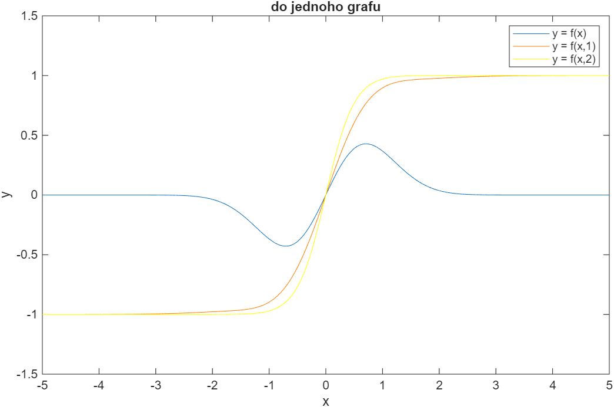
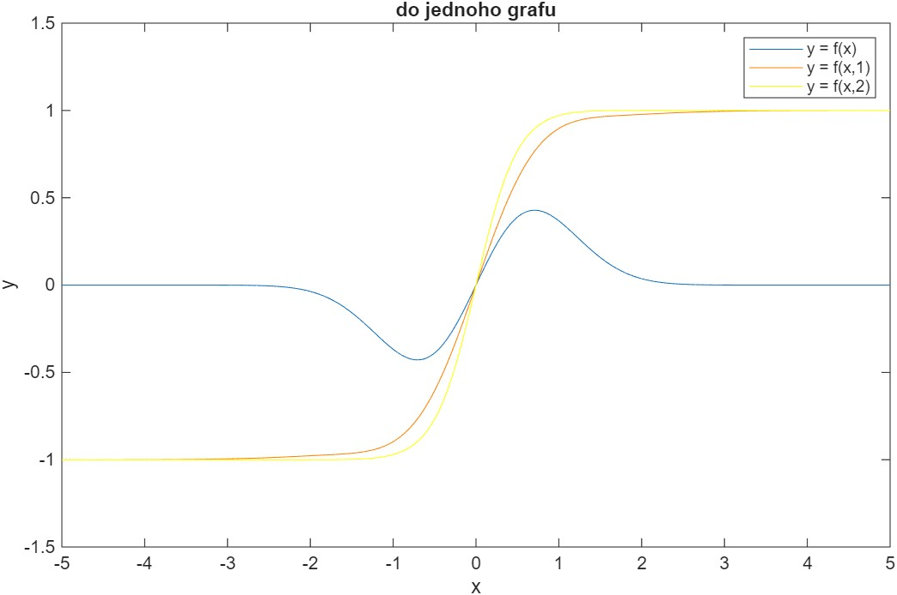

# Výpočty, simulace a vizualizace v Matlabu

Cvičení jsou zaměřená na **práci se skripty v Matlabu**, procvičení základních funkcí, tvorbu matic, práci s náhodnými čísly, cykly, funkcemi a jednoduchými algoritmy.

## Základy Matlabu

- Prostředí Matlabu, skripty a funkce
- Práce s okny, příkazy `clc`, `clear`, `close all`

  ## Vektory a matice

- Tvorba vektorů a matic
- Indexování, řádky vs. sloupce
- Operace: sčítání, násobení, transpozice, inverze

  ## Náhodná čísla a statistika

- Funkce `rand`, `randi`, `randn`
- Výpočty součtu, průměru, středních hodnot
- Manipulace s 3D maticemi

## Cyklus a podmínky

- `for`, `while`
- `if`, `else`, `elseif`
- Vnořené cykly a operace po prvcích

  ## Funkce a vlastní algoritmy

- Definice funkcí: `function`
- Implementace jednoduchých algoritmů (např. bubble sort)
- Vektorové vs. skalární operace

  ## Vizualizace

  - Grafy 2D a 3D (`plot`, `mesh`, `surf`)
  - Přehledné zobrazení dat a výsledků

## Základy a příkazy

- % - komentář
- ; na konci zamezí vypsání do konzole

### Zkratky

- ctrl R - koment
- ctrl T - zrusit koment
- F9 - spusti označenou cast kodu

### Udělat vždy

- clc; - vymaže konzoli
- clear;
- close all; - zavře soubory
- disp(x) - vypíše do konzole x (disp = display)
- 1:1:8 - generuje čísla od 1 do 8 po jednom

### Matice

- ones(3) - 3x3 matice s jedničkama
- zeros(3,4) - 3x4 matice s nulama
- eye(3) - jedničky na diagonale
- inv(Matice) - inverce matice
- A\*B - násobení matice
- A.\*B - násobení po prvcích

- squeeze(C(1,:,:)); - z 3D na 2D

### Random

- rand - nenáhodně
- randn - náhodně
- round zaokrouhlení
- mean - průměr
- numel - celkem prvku
- sum - součet

### Funkce

```matlab
function result = goniometricka_funkce(x)
    result = (sin(x)).^2 .* cos(x);
end
```

### Porovnání

- lexikograficky - porovná první řádek dvou sloupcu, pokud jsou stejné porovná druhý řádek

## Přehled výuky

<iframe src="https://elearning.tul.cz/course/view.php?id=20012" width="100%" height="800px"></iframe>

- [Přehled na Elearning](https://elearning.tul.cz/course/view.php?id=20012)

## Cvičení

### Zadání prvního cvičení

#### MATLB_cv1.pdf

<iframe src="./zadaniCv/MATLB_cv1.pdf" width="100%" height="800px"></iframe>

[Otevřít / Stáhnout MATLB_cv1.pdf](./zadaniCv/MATLB_cv1.pdf)

#### cv01.m

```matlab
clear;clc;
% cv 01
% 1
a = 1:50;
% 2
b = 1:0.2:10;
% 3
A = [1 1 1; 1 1 1; 1 1 1];
B = [0 0 0; 0 0 0; 0 0 0];
D = [1 0 0; 0 1 0; 0 0 1];
% 4
M = [A, B, D];
% 5
C = [1 -1 1; 1 -1 0; -1 0 1];
% 6
B1 = inv(C);
% 7
x1 = C .* B1;
x2 = C * B;
% 8
x3 = M' * C;
% 9
%C(:,2) = [randi(10, [3,1])];
C(:,2) = rand(3,1);
%C(:,2) = rand( size(C(:,2)) );
% 10
C(1, :) = [7, 8, 9];
% 11
C1 = C(1, 2:3);
% 12
for i = 1:size(C,1)
    for j = 1:size(C,2)
        if C(i, j) >= 0
            C(i, j) = 1;
        else
            C(i, j) = rand(1);
        end
    end
end
```

### Zadání druhého cvičení

#### MATLB_cv2.pdf

<iframe src="./zadaniCv/MATLB_cv2.pdf" width="100%" height="800px"></iframe>

[Otevřít / Stáhnout MATLB_cv2.pdf](./zadaniCv/MATLB_cv2.pdf)

#### cv02.m

```matlab
clear; clc;

% 1
minimum = 10;
maximum = 40;
r1 = floor(rand() * (maximum - minimum + 1)) + minimum;
r2 = floor(rand() * (maximum - minimum + 1)) + minimum;
r3 = floor(rand() * (maximum - minimum + 1)) + minimum;
C = randn(r1, r2, r3);

% 2
soucet = 0;
pocet_prvku = 0;
for i = 1:size(C,1)
    for j = 1:size(C,2)
        for k = 1:size(C,3)
            soucet = soucet + C(i, j, k);
            pocet_prvku = pocet_prvku + 1;
        end
    end
end
average = soucet / pocet_prvku;
average_sum = sum(C, "all") / pocet_prvku;
% 3
A = squeeze(C(1,:,:));
%radkove_prumery = mean(A, 2);
%A2 = A - radkove_prumery;
A2 = zeros(size(A));
for i = 1:size(A, 1)
     A2(i, :) = A(i, :) - mean(A(i, :));
end

%4
function y = fce_sin2_cos(x)
    y = (sin(x).^2) .* cos(x);
end
```

### Zadání třetího cvičení

V MATLAB Grader

#### cv03.m

```matlab
clc; close;
function Y = VecBubbleSort(X)
% Zde vlozte naprogramovanou funkci bublinkoveho razeni vektoru
% X - nesetridena vstupni matice
% Y - algoritmem setridena vystupni matice
Y = X;
for i = 1:size(Y, 2)-1 % sloupce % optimalizace a zrychleni kodu pomoci -1 a -i
    for j = 1:size(Y, 2)-i % sloupce
        for k = 1:size(Y, 1) % radky
            if Y(k, j) > Y(k, j + 1) % podminka pokud je prvni sloupec vetsi nez ten druhy (nasledujici)
                % logika bubble sortu, temp = pomocná proměnná temporary
                temp = Y(:,j);
                Y(:, j) = Y(:, j + 1);
                Y(:, j + 1) = temp;
                break % násilné ukonceni cyklu
            end
            if Y(k, j) < Y(k, j + 1) % pokud je menši tak at se cyklus ihned ukonci
                break
            end
        end
    end
end
end


B = round(randn(5,10));
disp('vstupní pole')
B
B_sorted = VecBubbleSort(B);
disp('seřazené pole')
B_sorted
```

### Zadání čtvrtého cvičení

V MATLAB Grader

#### cv04cipher.m

```matlab
clear; clc;


function cipher = cipher_for(text,key)

    keyNums = double(key);
    [keySorted, numbers] = sort(keyNums);


    k = 1;
    l = 1;
    for i = 1:size(text, 2)
        M(k, l) = text(i);
        l = l + 1;
        if mod(i, length(key)) == 0
            k = k+1;
            l = 1;
        end
    end

    for i = 1:ceil(length(text)/length(key))
        for j = 1:length(key)
            M_cipher(i,j) = M(i,numbers(j));
        end
    end

    for k = 1:numel(M_cipher)
        cipher(1,k) = M_cipher(k);
    end

end

function cipher = cipher_task(text, key)
    % cipher = cipher_task(text, key)
    % text - libovolne dlouhy retezec (pole char, radkovy vektor)
    % key - libovolny retezec (pole char) kratsi/stejne dlouhy jako text: length(text)>=length(key)
    % cipher - vystupni retezec - sifra - radkovy vektor

    keyNums = double(key); % prevod klíčů na ascii hodnoty
    [~, numbers] = sort(keyNums); % ~ pro ignorovani, serazeni klíčů

    numRows = ceil(length(text) / length(key));
    paddedText = pad(text, numRows * length(key));
    M = reshape(paddedText, length(key), numRows)';
    M_cipher = M(:, numbers);
    cipher = M_cipher(:)';

end

key = 'stolek';
text = 'AHOJJAJSEMTVUJSUPERPOMOCNIK';
% šifrovaní původní funkcí
disp('Sifrovany vystup funkce cipher_for(text,key):')
cipher_for_var = cipher_for(text,key);
disp(cipher_for_var);
disp(newline)

disp('Sifrovany vystup vasi funkce cipher_task(text,key):')
cipher = cipher_task(text, key);
disp(cipher)
```

#### cv04decipher.m

```matlab
clear; clc;

function text = decipher_for(cipher,key)

    keyNums = double(key);
    [keySorted, numbers] = sort(keyNums);

    k = 1;
    l = 1;
    for i = 1:size(cipher, 2)
        M_cipher(l, k) = cipher(i);
        l = l + 1;
        if mod(i, length(cipher)/length(key)) == 0
            k = k+1;
            l = 1;
        end
    end

    for i = 1:ceil(length(cipher)/length(key))
        for j = 1:length(key)
            M(i,j) = M_cipher(i,numbers(j));
        end
    end

    M = M';

    for k = 1:numel(M_cipher)
        text(1,k) = M(k);
    end

end

function text = decipher_task(cipher,key)
    % text = decipher_task(cipher, key)
    % cipher - zasifrovany text (pole char, radkovy vektor, delka delitelna delkou klice)
    % key - libovolny retezec (pole char), delka klice je delitelem delky cipher
    % text - vystupni retezec - desifrovany text - radkovy vektor
    keyNums = double(key);
    [~, numbers] = sort(keyNums);

    rows = length(cipher) / length(key);
    M_cipher = reshape(cipher, rows, []);
    M = M_cipher(:, numbers);
    text = M';
    text = text(:)';
end


key = 'STOLEK';
cipher = 'UESSDL KTUTMI OAEZIBGUKAARJ N ';

disp('Desifrovany vystup vasi funkce decipher_task(text,key):')
text = decipher_task(cipher, key);
disp(text)
```

### Zadání pátého cvičení

#### MATLB_cv5.pdf

<iframe src="./zadaniCv/MATLB_cv5.pdf" width="100%" height="800px"></iframe>

[Otevřít / Stáhnout MATLB_cv5.pdf](./zadaniCv/MATLB_cv5.pdf)

#### cv05.m

```matlab
clc; close;

% 1

phi = 0:(pi/3):2*pi;
x = cos(phi);
y = sin(phi);

figure;
plot(x, y);
axis equal;

% 2

function result = evaluateFunction(x, y)

    if nargin < 2
        y = 0;
    end
    result = x.*exp(-x.^2-y.^2)+tanh(x.*y);
end

result1 = evaluateFunction([1, 2, 3]);
disp(result1);

result2 = evaluateFunction([1, 2, 3], [4, 5, 6]);
disp(result2);

% 3

x =-5:0.05:5;

y1 = evaluateFunction(x);
y2 = evaluateFunction(x, 1);
y3 = evaluateFunction(x, 2);

% a

figure;
plot(x, y1, 'DisplayName', 'y = f(x)');
hold on;
plot(x, y2, 'Color', [1, 0.5, 0], 'DisplayName', 'y = f(x,1)');
plot(x, y3, 'Color', [1, 1, 0], 'DisplayName', 'y = f(x,2)');
hold off;
xlabel('x');
ylabel('y');
title('do jednoho grafu');
legend show;

exportgraphics(gcf, 'plot.jpg');
tempFileName = 'temp_plot.png';
exportgraphics(gcf, tempFileName);
img = imread(tempFileName);
imwrite(img, 'plot.bmp');
print(gcf, 'plot.pdf', '-dpdf');
delete(tempFileName);

% b

figure;
ax1 = subplot(3, 1, 1);
plot(x, y1);
title('subplot 1');
xlabel('x');
ylabel('f(x)');

ax2 = subplot(3, 1, 2);
plot(x, y2);
title('subplot 2');
xlabel('x');
ylabel('f(x, 1)');

ax3 = subplot(3, 1, 3);
plot(x, y3);
title('subplot 3');
xlabel('x');
ylabel('f(x, 2)');

linkaxes([ax1, ax2, ax3], 'x');
savefig('subplots.fig');

% 4

x = -5:0.1:5;
y = -6:0.2:6;

[X, Y] = meshgrid(x, y);

Z = evaluateFunction(X, Y);

figure;
surf(X, Y, Z);
title('3D plocha')
xlabel('x');
ylabel('y');
zlabel('f(x, y)');
grid on;
```

#### Soubory pátého cvičení




<iframe src="./filesCv5/plot.pdf" width="100%" height="800px"></iframe>

### Zadání šestého cvičení

#### MATLB_cv6.pdf

<iframe src="./zadaniCv/MATLB_cv6.pdf" width="100%" height="800px"></iframe>

[Otevřít / Stáhnout MATLB_cv6.pdf](./zadaniCv/MATLB_cv6.pdf)

#### cv06.m

```matlab
clc; close;


```
