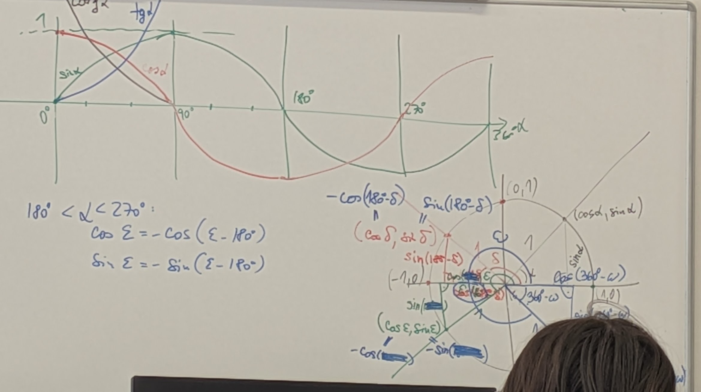
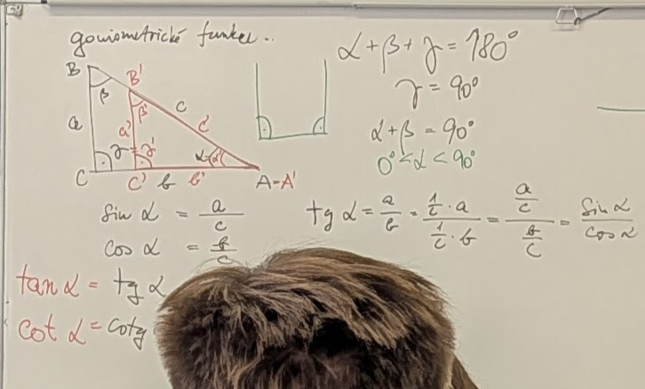
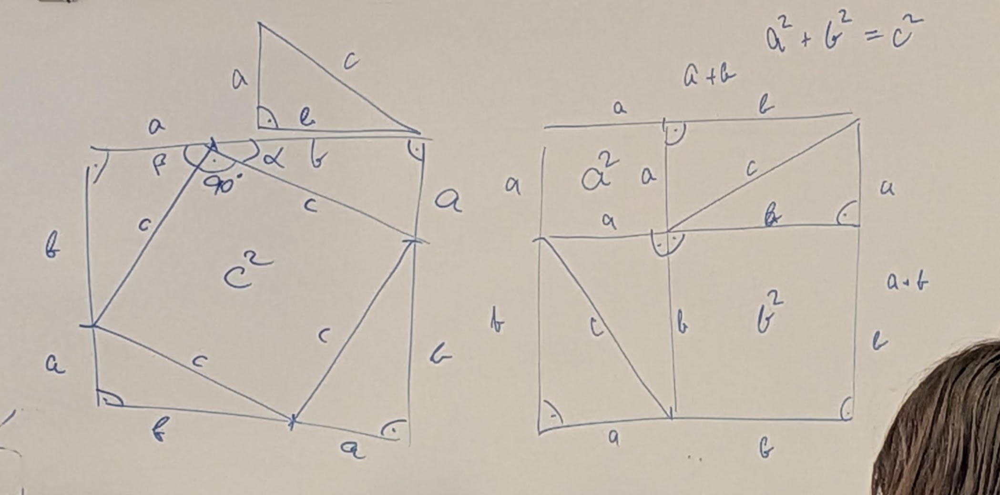
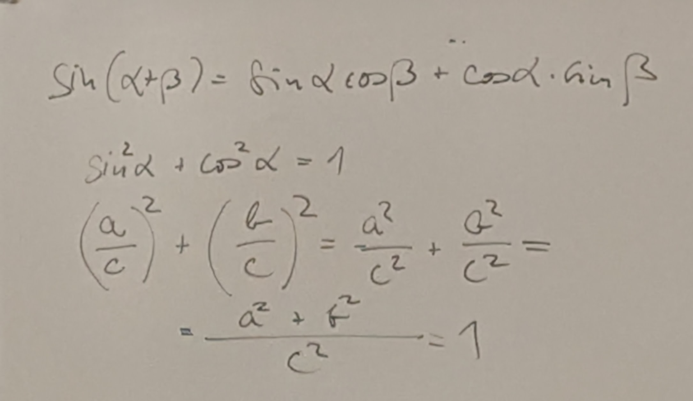
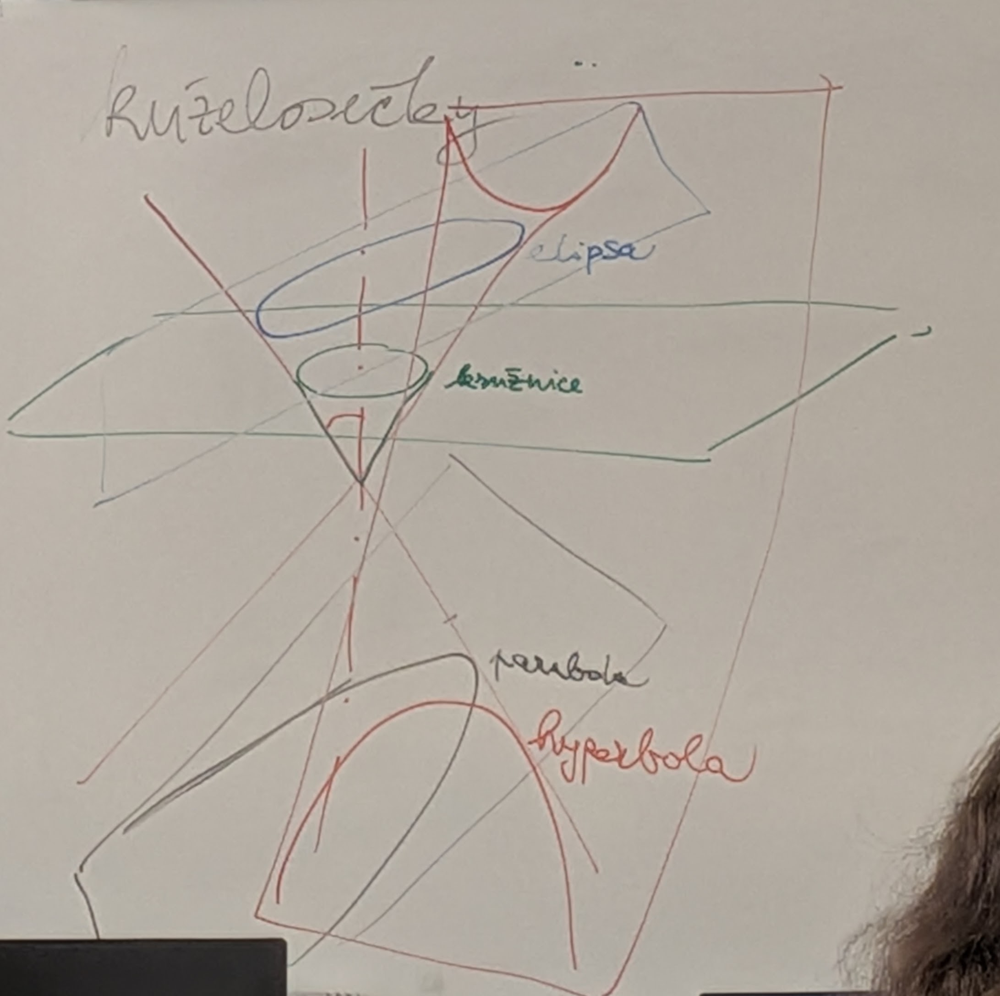
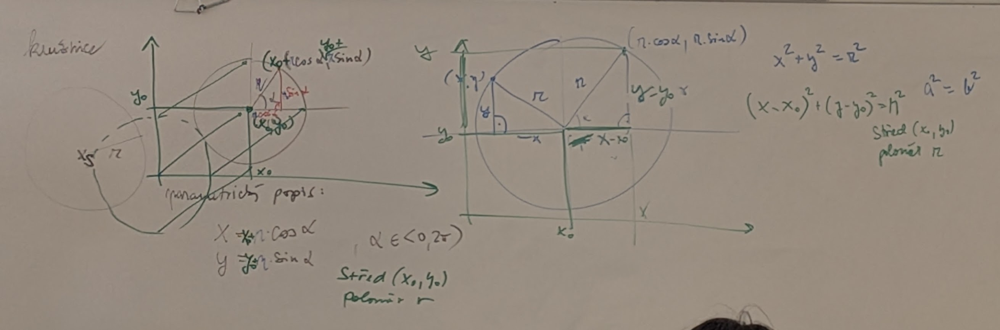
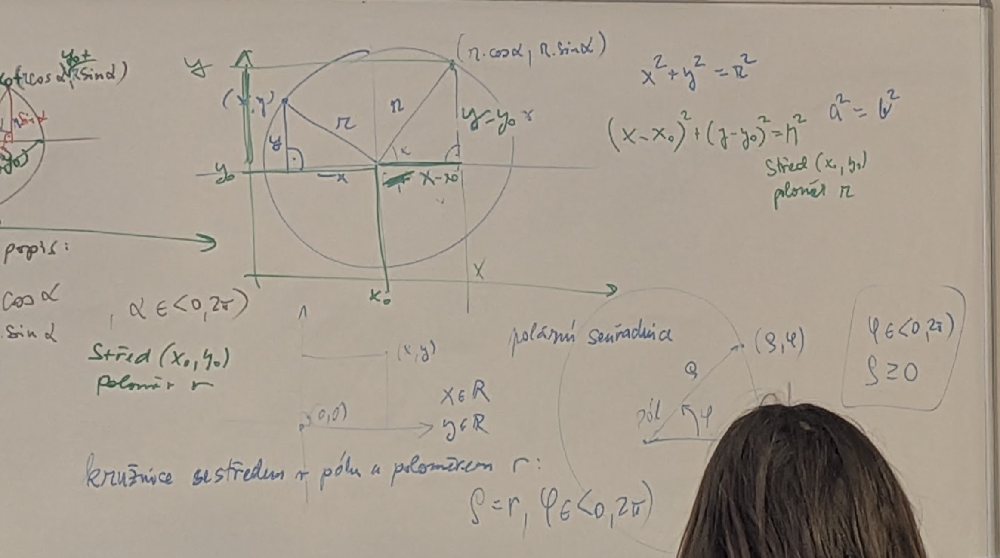
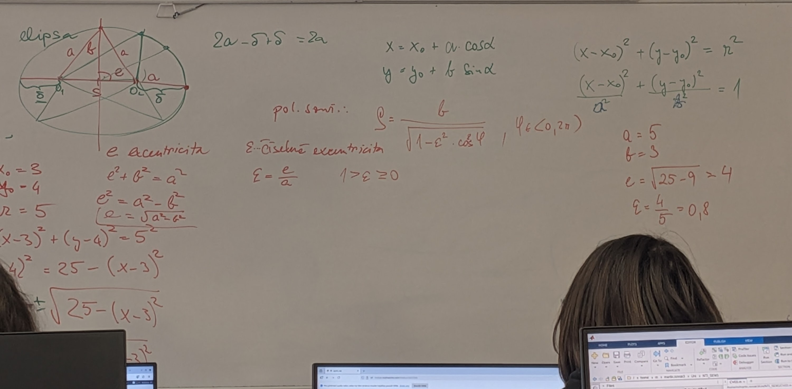
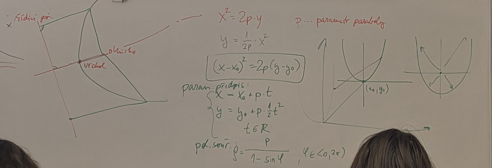
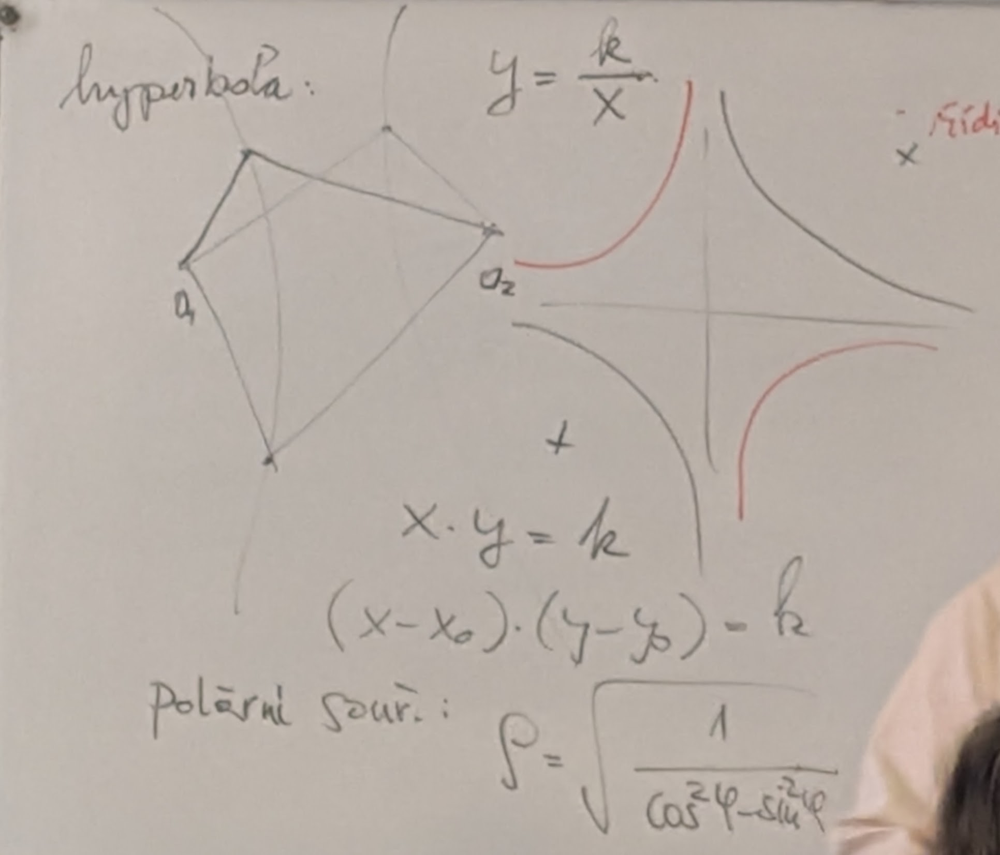

# Matematika Seminář

Obsah složky `seminar`:

- `1.jpg`, `2.jpg`, `3.jpg`, `4.jpg`, `kuželosečky 1.jpg`, `kuželosečky 2.jpg`, `kuželosečky 3.jpg`, `kuželosečky 4.jpg`,`kuželosečky 5.jpg`,`kuželosečky 6.jpg`

## Goniometrické funkce

## Kuželosečky

